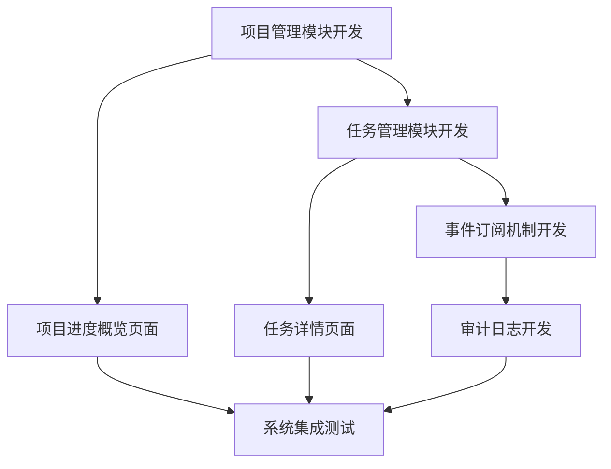

# Iteration 1 敏捷项目管理计划

## 项目基本信息

**项目名称**: OpenClaw AI Agent专属项目管理系统
**迭代编号**: Iteration 1 (v1.0)
**开始日期**: 2026-03-13
**结束日期**: 2026-03-26
**迭代时长**: 14 天

## 迭代目标

- 实现系统核心功能，确保项目能够正常运行
- 完成产品待办列表中 P0 优先级的 10 个用户故事
- 确保项目管理和任务管理功能的完整性
- 建立基本的可视化监控和审计功能

## 产品待办列表 (Product Backlog)

### 迭代1 用户故事

| 用户故事 | 功能域 | 负责人 | 预估工时 | 状态 |
|----------|--------|--------|----------|------|
| US001 | 项目管理 | 后端开发 | 3天 | 待开始 |
| US004 | 项目管理 | 后端开发 | 2天 | 待开始 |
| US005 | 任务管理 | 后端开发 | 3天 | 待开始 |
| US006 | 任务管理 | 后端开发 | 2天 | 待开始 |
| US007 | 任务管理 | 后端开发 | 2天 | 待开始 |
| US010 | 事件订阅 | 后端开发 | 2天 | 待开始 |
| US013 | 可视化监控 | 前端开发 | 3天 | 待开始 |
| US014 | 可视化监控 | 前端开发 | 3天 | 待开始 |
| US017 | 审计与合规 | 后端开发 | 2天 | 待开始 |
| US020 | 审计与合规 | 后端开发 | 2天 | 待开始 |

## 任务拆解

### 后端开发任务 (Backend)
- [ ] US001 - 项目管理：项目创建与查询
- [ ] US004 - 项目管理：项目信息更新
- [ ] US005 - 任务管理：任务创建与分配
- [ ] US006 - 任务管理：任务状态跟踪
- [ ] US007 - 任务管理：任务依赖关系管理
- [ ] US010 - 事件订阅：系统事件订阅机制
- [ ] US017 - 审计与合规：审计日志记录
- [ ] US020 - 审计与合规：系统安全审计

### 前端开发任务 (Frontend)
- [ ] US013 - 可视化监控：项目进度概览
- [ ] US014 - 可视化监控：任务详情页面

### 设计任务 (Design)
- [ ] UI设计稿：项目管理页面
- [ ] UI设计稿：任务管理页面
- [ ] 交互设计：系统操作流程

### 测试任务 (Testing)
- [ ] 测试计划：Iteration 1 测试计划
- [ ] 功能测试：核心功能测试
- [ ] 接口测试：API接口测试

## 依赖关系

## 风险识别和应对

### 技术风险
1. **需求变更**
   - 风险等级：高
   - 应对措施：建立变更控制流程，评估变更影响
   - 负责人：产品经理

2. **开发延期**
   - 风险等级：中
   - 应对措施：优化任务分解，合理安排资源
   - 负责人：项目负责人

3. **技术风险**
   - 风险等级：低
   - 应对措施：提前技术选型，制定技术方案
   - 负责人：技术负责人

4. **质量问题**
   - 风险等级：低
   - 应对措施：建立测试流程，严格质量控制
   - 负责人：测试工程师

## 质量目标

- 代码质量：通过代码审查和静态分析工具确保代码质量
- 功能覆盖：所有用户故事都有对应的测试用例
- 性能目标：响应时间 < 2秒
- 安全性：实现基本的安全防护措施
- 代码标准：遵循团队代码规范，代码注释率≥30%，单元测试覆盖率≥60%

## 交付物

1. **前端代码**：实现项目管理和任务管理的前端界面
2. **后端代码**：实现系统核心功能的后端服务
3. **数据库设计文档**：系统数据库架构设计
4. **API接口文档**：系统API接口规范
5. **测试计划和用例**：Iteration 1 测试计划和测试用例
6. **部署文档**：系统部署方案
7. **用户手册**：系统操作手册

## 验收标准

1. 所有用户故事都已实现
2. 代码通过代码审查
3. 测试覆盖率达到80%以上
4. 系统能够正常运行和部署
5. 功能测试100%通过
6. 性能测试达标（响应时间≤500ms）
7. 用户验收通过

## 团队成员和职责

| 角色 | 姓名 | 职责 |
|------|------|------|
| 前端高级开发工程师 | 李四 | 负责前端开发工作 |
| 后台高级开发工程师 | 张三 | 负责后端开发工作 |
| 高级测试工程师 | 赵六 | 负责测试工作 |
| 高级产品经理 | Jack | 负责产品设计和需求分析 |
| 高级设计师 | 王五 | 负责UI设计工作 |

## 每日站会安排

- 时间：每天上午 09:30
- 地点：飞书群聊
- 时长：15分钟
- 内容：
  - 昨天完成的工作
  - 今天计划完成的工作
  - 遇到的问题和困难
  - 需要的支持和帮助
- 输出：站会记录

## 评审会议安排

- **代码审查**：每日提交代码后进行
- **接口评审**：每周二、周四下午 14:00
- **需求评审**：迭代开始前和需求变更时
- **迭代评审**：2026年3月26日下午，展示功能实现、收集反馈、调整需求
- **迭代回顾**：2026年3月26日下午，总结迭代经验、识别改进点、制定改进计划

## 变更管理流程

1. 提交变更申请
2. 评估变更影响
3. 变更审批
4. 实施变更
5. 变更验证

## 结束条件

1. 所有用户故事都已完成
2. 产品负责人确认验收通过
3. 客户验收通过
4. 文档齐全，符合规范

---

**文档创建时间**: 2026-03-13
**文档版本: v2.0
**文档状态: 已更新
