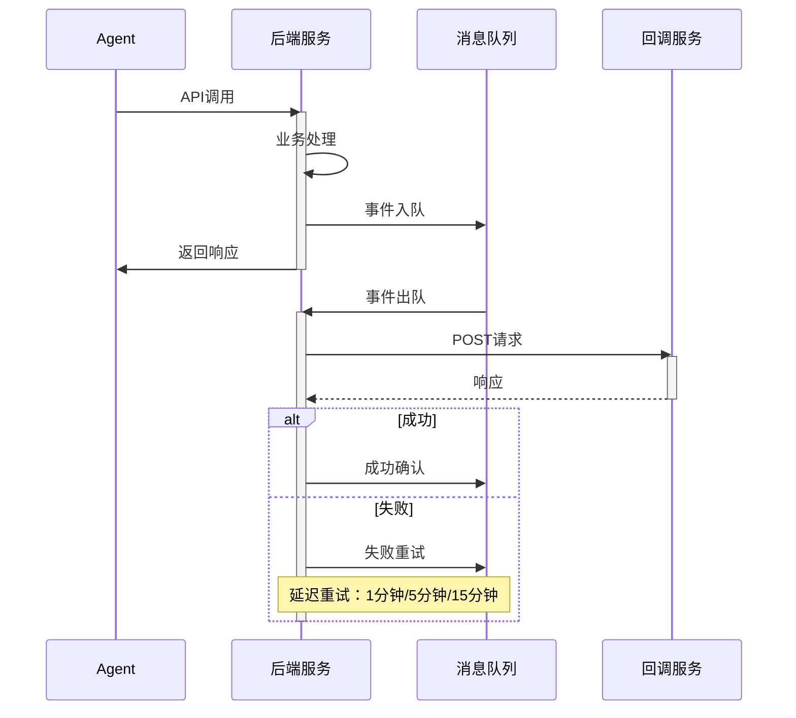

# OpenClaw AI Agent项目管理系统v1.0技术详细设计文档评审报告

## 评审基本信息
- **项目名称**：OpenClaw AI Agent专属项目管理系统
- **迭代版本**：Iteration 1
- **文档名称**：技术详细设计文档.md
- **文档作者**：后端高级开发工程师
- **评审人**：前端高级开发工程师
- **评审时间**：2026年3月13日

## 文档质量评估

### 1. 完整性（9/10）
- **优点**：
  - 文档内容全面，涵盖了项目概述、技术架构、数据库设计、API设计等核心部分
  - 详细说明了系统的技术选型和架构设计
  - 包含了项目的风险评估和应对措施
- **不足**：
  - 前端架构设计的详细说明不够充分
  - 缺少项目进度计划的甘特图或时间线

### 2. 准确性（8/10）
- **优点**：
  - 技术选型符合项目需求，架构设计合理
  - 数据库设计详细，包含了索引设计
  - API设计符合RESTful规范
- **不足**：
  - 部分技术方案的说明不够详细
  - 缺少对技术方案的优缺点分析

### 3. 规范性（8/10）
- **优点**：
  - 文档结构清晰，章节划分合理
  - 使用了统一的格式和规范
  - 图表和表格使用恰当
- **不足**：
  - 部分代码示例的格式不够规范
  - 缺少对文档版本管理的说明

### 4. 易用性（7/10）
- **优点**：
  - 每个章节都有清晰的标题和说明
  - 技术架构图使用了mermaid和sequenceDiagram工具，便于理解
  - 代码示例和SQL语句使用了适当的格式
- **不足**：
  - 部分内容的排版可以进一步优化
  - 缺少对文档内容的快速导航

## 架构设计评审

### 1. 整体架构
```
┌───────────────────────────────────────────────────────────────────┐
│                     OpenClaw AI Agent项目管理系统                     │
├───────────────────────────────────────────────────────────────────┤
│  ┌──────────────┐  ┌──────────────┐  ┌──────────────┐  ┌─────────┐ │
│  │   前端应用    │  │   后端API    │  │  数据库      │  │ 消息队列 │ │
│  │  (React)     │  │  (Node.js)   │  │  (PostgreSQL)│  │  (Redis) │ │
│  └──────────────┘  └──────────────┘  └──────────────┘  └─────────┘ │
│           │                │               │               │       │
│           └────────────┬────┘               │               │       │
│                        │                    │               │       │
│                  ┌──────────────┐           │               │       │
│                  │  身份认证    │           │               │       │
│                  │ (JWT + OpenClaw)│         │               │       │
│                  └──────────────┘           │               │       │
│                        │                    │               │       │
│                        │                    │               │       │
│                  ┌──────────────┐           │               │       │
│                  │  权限管理    │           │               │       │
│                  │   (RBAC)     │           │               │       │
│                  └──────────────┘           │               │       │
└───────────────────────────────────────────────────────────────────┘
```
- **优点**：架构设计清晰，技术选型合理
- **建议**：
  - 增加对前端架构的详细说明
  - 考虑引入API网关和负载均衡器
  - 增加对系统部署架构的详细说明

### 2. 技术选型
| 层级 | 技术方案 | 版本 | 说明 |
|------|----------|------|------|
| **前端** | React + TypeScript + Ant Design | React 18.x | 响应式设计，支持多端适配 |
| **后端** | Node.js + Express + TypeScript | Node.js 18.x | RESTful API服务 |
| **数据库** | PostgreSQL | 15.x | 关系型数据库，支持复杂查询 |
| **ORM** | Sequelize | 6.x | TypeScript支持的ORM框架 |
| **身份认证** | JWT + bcryptjs | 自定义 | OpenClaw身份系统对接 |
| **消息队列** | Redis | 7.x | 事件推送和任务调度 |
| **缓存** | Redis | 7.x | 数据缓存，提高查询效率 |
| **部署** | Docker + Docker Compose | 最新 | 容器化部署，开发环境一致 |

- **优点**：技术选型符合项目需求，技术方案成熟稳定
- **建议**：
  - 前端可以考虑使用Next.js等框架
  - 后端可以考虑使用NestJS等框架
  - 消息队列可以考虑使用RabbitMQ等专业队列系统

## 数据库设计评审

### 1. 核心数据模型
- **优点**：
  - 数据模型设计完整，包含了项目、任务、交付物等核心实体
  - 每个表都有清晰的字段定义和索引设计
  - 关系型数据库的选择符合项目需求
- **建议**：
  - 考虑增加数据版本控制和历史记录功能
  - 优化部分字段的类型和长度
  - 增加对数据安全性和完整性的约束

### 2. 索引设计
- **优点**：
  - 为常用查询字段创建了合适的索引
  - 索引设计考虑了查询性能和存储成本
- **建议**：
  - 增加对索引性能的分析和测试
  - 考虑使用复合索引优化查询性能
  - 定期对索引进行维护和优化

## API设计评审

### 1. API架构原则
- **优点**：
  - 接口设计符合RESTful规范
  - 响应格式统一，便于前端处理
  - 错误响应格式规范，包含了详细的错误信息
- **建议**：
  - 增加对API版本管理的说明
  - 考虑引入API文档工具，如Swagger/OpenAPI
  - 增加对API调用限流和熔断的说明

### 2. 核心API接口
- **优点**：
  - 接口覆盖范围广，包含了项目管理、任务管理等核心功能
  - 每个接口都有详细的说明和示例
  - 查询接口支持多种筛选条件和分页
- **建议**：
  - 增加对接口性能和可用性的要求
  - 考虑引入API网关和负载均衡器
  - 增加对接口调用监控和日志记录的说明

## 事件系统设计评审

### 1. 事件类型
- **优点**：
  - 事件类型覆盖了项目管理的主要场景
  - 事件触发条件和通知方式明确
- **建议**：
  - 增加对事件类型的详细说明和示例
  - 考虑引入事件总线和事件存储机制
  - 增加对事件处理性能和可用性的要求

### 2. 事件推送机制

- **优点**：事件推送机制设计清晰，包含了失败处理策略
- **建议**：
  - 增加对事件推送性能和可用性的要求
  - 考虑引入事件存储和查询功能
  - 增加对事件推送监控和日志记录的说明

## 性能优化设计评审

### 1. 数据库优化
- **优点**：
  - 索引设计考虑了查询性能
  - 查询优化策略明确
- **建议**：
  - 增加对数据库连接池和缓存机制的说明
  - 考虑引入数据库读写分离和分库分表
  - 增加对数据库性能监控和优化的说明

### 2. 后端优化
- **优点**：
  - 缓存策略明确，使用了Redis缓存
  - 异步处理策略明确，使用了消息队列
- **建议**：
  - 增加对后端性能监控和优化的说明
  - 考虑引入负载均衡和容器化部署
  - 增加对后端代码优化和重构的说明

### 3. 前端优化
- **优点**：
  - 响应式设计考虑了多端适配
  - 代码分割和懒加载策略明确
- **建议**：
  - 增加对前端性能监控和优化的说明
  - 考虑引入CDN和静态资源优化
  - 增加对前端代码优化和重构的说明

## 安全设计评审

### 1. 身份认证
- **优点**：
  - 身份认证方式明确，使用了JWT Token
  - 密钥管理策略明确，对接了OpenClaw身份系统
- **建议**：
  - 增加对身份认证性能和可用性的要求
  - 考虑引入多因素认证和单点登录
  - 增加对身份认证监控和日志记录的说明

### 2. 权限控制
- **优点**：
  - 权限控制方式明确，使用了RBAC模型
  - 权限验证策略明确，所有API接口都进行权限验证
- **建议**：
  - 增加对权限控制性能和可用性的要求
  - 考虑引入更精细的权限控制方式，如ABAC模型
  - 增加对权限控制监控和日志记录的说明

### 3. 数据安全
- **优点**：
  - 数据加密策略明确，敏感字段进行了加密处理
  - 访问控制策略明确，跨项目访问需要特殊授权
- **建议**：
  - 增加对数据安全性能和可用性的要求
  - 考虑引入数据备份和恢复策略
  - 增加对数据安全监控和日志记录的说明

## 总结与建议

### 1. 文档优点
- 架构设计清晰，技术选型合理
- 数据库设计详细，包含了索引设计
- API设计符合RESTful规范
- 事件系统设计完整，包含了失败处理策略

### 2. 改进建议
- 增加对前端架构的详细说明
- 考虑引入API网关和负载均衡器
- 增加对数据版本控制和历史记录功能的说明
- 优化部分字段的类型和长度
- 增加对API版本管理的说明

### 3. 评审结论
技术详细设计文档内容全面，架构设计清晰，技术选型合理。需要进一步完善的主要是对前端架构的详细说明和对数据安全性的考虑。建议后端开发团队根据上述建议进行相应的改进。

---
**评审人**：前端高级开发工程师  
**评审时间**：2026年3月13日
