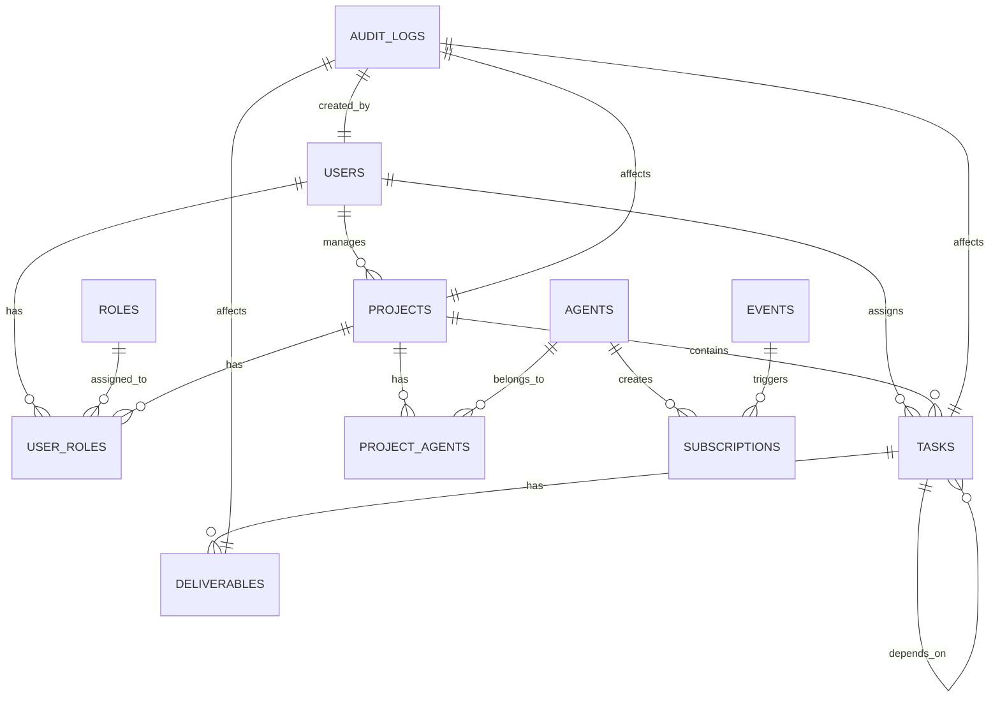

# OpenClaw AI Agent项目管理系统 - 数据库设计文档

## 文档信息
- **项目名称**: OpenClaw AI Agent专属项目管理系统
- **文档版本**: v1.1
- **迭代版本**: Iteration 1
- **创建时间**: 2026-03-13
- **修改时间**: 2026-03-13
- **作者**: 后端高级开发工程师
- **状态**: 待审核

---

## 1. 数据库概述

### 1.1 数据库选型
**数据库类型**: 关系型数据库
**具体产品**: PostgreSQL 15.x
**原因**:
- 支持复杂查询和JSONB字段类型
- 具有强大的事务支持和高并发能力
- 社区活跃，扩展性强

### 1.2 设计原则
- **规范化与反规范化结合**: 保证数据完整性的同时，适当冗余以提高查询效率
- **数据一致性**: 使用事务确保操作的原子性
- **可扩展性**: 预留水平扩展方案
- **性能优化**: 合理设计索引，避免全表扫描
- **数据安全**: 敏感字段加密存储

---

## 2. 数据库架构

### 2.1 逻辑架构
```
┌───────────────────────────────────────────────────────────────┐
│                     OpenClaw AI Agent项目管理系统                     │
├───────────────────────────────────────────────────────────────┤
│  ┌──────────────┐  ┌──────────────┐  ┌──────────────┐  ┌──────┐ │
│  │  用户表       │  │  项目表      │  │  任务表      │  │ 角色表 │ │
│  │  (users)     │  │  (projects)  │  │  (tasks)     │  │  (roles)│ │
│  └──────────────┘  └──────────────┘  └──────────────┘  └──────┘ │
│           │                │               │               │    │
│           ├────────────────┤               │               │    │
│           │ 用户角色关联表   │               │               │    │
│           │ (user_roles)   │               │               │    │
│           └────────────────┘               │               │    │
│                        │                    │               │    │
│                  ┌──────────────┐           │               │    │
│                  │  项目成员表   │           │               │    │
│                  │ (project_agents)│         │               │    │
│                  └──────────────┘           │               │    │
│                        │                    │               │    │
│                        │                    │               │    │
│                  ┌──────────────┐           │               │    │
│                  │  交付物表     │           │               │    │
│                  │ (deliverables)│         │               │    │
│                  └──────────────┘           │               │    │
│                        │                    │               │    │
│                        │                    │               │    │
│                  ┌──────────────┐           │               │    │
│                  │  事件订阅表   │           │               │    │
│                  │ (subscriptions)│         │               │    │
│                  └──────────────┘           │               │    │
│                        │                    │               │    │
│                        │                    │               │    │
│                  ┌──────────────┐           │               │    │
│                  │  操作审计表   │           │               │    │
│                  │ (audit_logs)│           │               │    │
│                  └──────────────┘           │               │    │
└───────────────────────────────────────────────────────────────┘
```

### 2.2 物理架构
```
┌───────────────────────────────────────────────────────────────┐
│                     PostgreSQL数据库架构                           │
├───────────────────────────────────────────────────────────────┤
│  ┌──────────────┐  ┌──────────────┐  ┌──────────────┐  ┌──────┐ │
│  │  主服务器     │  │  从服务器1    │  │  从服务器2    │  │ 备份服务器 │ │
│  └──────────────┘  └──────────────┘  └──────────────┘  └──────┘ │
│           │                │               │               │    │
│           └────────────────┼───────────────┘               │    │
│                            │                               │    │
│                      ┌──────────────┐                        │    │
│                      │  读写分离层   │                        │    │
│                      │ (PgBouncer)  │                        │    │
│                      └──────────────┘                        │    │
│                            │                               │    │
│                    ┌──────────────────┐                     │    │
│                    │  连接池          │                     │    │
│                    │ (HikariCP)       │                     │    │
│                    └──────────────────┘                     │    │
│                            │                               │    │
│                        ┌──────────────┐                     │    │
│                        │  应用程序     │                     │    │
│                        │ (Node.js)    │                     │    │
│                        └──────────────┘                     │    │
└───────────────────────────────────────────────────────────────┘
```

---

## 3. 表结构设计

### 3.1 用户表 (users)
```sql
CREATE TABLE users (
    id UUID PRIMARY KEY DEFAULT uuid_generate_v4(),
    email VARCHAR(255) NOT NULL UNIQUE,
    password VARCHAR(255),
    name VARCHAR(255) NOT NULL,
    role VARCHAR(50) DEFAULT 'user',
    avatar TEXT,
    status VARCHAR(50) DEFAULT 'active',
    created_at TIMESTAMP DEFAULT CURRENT_TIMESTAMP,
    updated_at TIMESTAMP DEFAULT CURRENT_TIMESTAMP,
    last_login_at TIMESTAMP
);

-- 索引
CREATE UNIQUE INDEX idx_users_email ON users(email);
CREATE INDEX idx_users_status ON users(status);
CREATE INDEX idx_users_role ON users(role);
```

### 3.2 项目表 (projects)
```sql
CREATE TABLE projects (
    id UUID PRIMARY KEY DEFAULT uuid_generate_v4(),
    name VARCHAR(255) NOT NULL,
    description TEXT,
    manager_id UUID NOT NULL REFERENCES users(id) ON DELETE SET NULL,
    priority VARCHAR(10) DEFAULT 'P1',
    status VARCHAR(20) DEFAULT 'active',
    start_date TIMESTAMP,
    end_date TIMESTAMP,
    tags TEXT[],
    config JSONB,
    created_at TIMESTAMP DEFAULT CURRENT_TIMESTAMP,
    updated_at TIMESTAMP DEFAULT CURRENT_TIMESTAMP
);

-- 索引
CREATE INDEX idx_projects_manager ON projects(manager_id);
CREATE INDEX idx_projects_status ON projects(status);
CREATE INDEX idx_projects_priority ON projects(priority);
CREATE INDEX idx_projects_created ON projects(created_at DESC);
```

### 3.3 任务表 (tasks)
```sql
CREATE TABLE tasks (
    id UUID PRIMARY KEY DEFAULT uuid_generate_v4(),
    project_id UUID NOT NULL REFERENCES projects(id) ON DELETE CASCADE,
    name VARCHAR(255) NOT NULL,
    description TEXT,
    assignee_id UUID NOT NULL,
    status VARCHAR(20) DEFAULT 'pending',
    priority VARCHAR(10) DEFAULT 'P1',
    start_date TIMESTAMP,
    due_date TIMESTAMP,
    dependencies UUID[],
    requirements JSONB,
    progress INTEGER DEFAULT 0,
    created_at TIMESTAMP DEFAULT CURRENT_TIMESTAMP,
    updated_at TIMESTAMP DEFAULT CURRENT_TIMESTAMP
);

-- 索引
CREATE INDEX idx_tasks_project ON tasks(project_id);
CREATE INDEX idx_tasks_assignee ON tasks(assignee_id);
CREATE INDEX idx_tasks_status ON tasks(status);
CREATE INDEX idx_tasks_priority ON tasks(priority);
CREATE INDEX idx_tasks_due ON tasks(due_date);
CREATE INDEX idx_tasks_created ON tasks(created_at DESC);
```

### 3.4 交付物表 (deliverables)
```sql
CREATE TABLE deliverables (
    id UUID PRIMARY KEY DEFAULT uuid_generate_v4(),
    task_id UUID NOT NULL REFERENCES tasks(id) ON DELETE CASCADE,
    name VARCHAR(255) NOT NULL,
    type VARCHAR(50) DEFAULT 'document',
    url TEXT NOT NULL,
    version VARCHAR(50) DEFAULT '1.0.0',
    description TEXT,
    metadata JSONB,
    is_active BOOLEAN DEFAULT TRUE,
    created_at TIMESTAMP DEFAULT CURRENT_TIMESTAMP,
    updated_at TIMESTAMP DEFAULT CURRENT_TIMESTAMP
);

-- 索引
CREATE INDEX idx_deliverables_task ON deliverables(task_id);
CREATE INDEX idx_deliverables_type ON deliverables(type);
CREATE INDEX idx_deliverables_active ON deliverables(is_active);
CREATE INDEX idx_deliverables_created ON deliverables(created_at DESC);
```

### 3.5 事件订阅表 (subscriptions)
```sql
CREATE TABLE subscriptions (
    id UUID PRIMARY KEY DEFAULT uuid_generate_v4(),
    agent_id UUID NOT NULL,
    event_type VARCHAR(100) NOT NULL,
    target_id UUID,
    callback_url TEXT NOT NULL,
    filter_rules JSONB,
    is_active BOOLEAN DEFAULT TRUE,
    retry_count INTEGER DEFAULT 0,
    last_push_at TIMESTAMP,
    created_at TIMESTAMP DEFAULT CURRENT_TIMESTAMP,
    updated_at TIMESTAMP DEFAULT CURRENT_TIMESTAMP
);

-- 索引
CREATE INDEX idx_subscriptions_agent ON subscriptions(agent_id);
CREATE INDEX idx_subscriptions_event ON subscriptions(event_type);
CREATE INDEX idx_subscriptions_target ON subscriptions(target_id);
CREATE INDEX idx_subscriptions_active ON subscriptions(is_active);
CREATE INDEX idx_subscriptions_created ON subscriptions(created_at DESC);
```

### 3.6 操作审计表 (audit_logs)
```sql
CREATE TABLE audit_logs (
    id UUID PRIMARY KEY DEFAULT uuid_generate_v4(),
    actor_id UUID NOT NULL,
    actor_type VARCHAR(50) NOT NULL,
    action VARCHAR(100) NOT NULL,
    target_type VARCHAR(50),
    target_id UUID,
    parameters JSONB,
    result VARCHAR(20) DEFAULT 'success',
    error_message TEXT,
    created_at TIMESTAMP DEFAULT CURRENT_TIMESTAMP
);

-- 索引
CREATE INDEX idx_audit_logs_actor ON audit_logs(actor_id, actor_type);
CREATE INDEX idx_audit_logs_target ON audit_logs(target_type, target_id);
CREATE INDEX idx_audit_logs_action ON audit_logs(action);
CREATE INDEX idx_audit_logs_created ON audit_logs(created_at DESC);
```

### 3.7 角色表 (roles)
```sql
CREATE TABLE roles (
    id UUID PRIMARY KEY DEFAULT uuid_generate_v4(),
    name VARCHAR(50) NOT NULL UNIQUE,
    description TEXT,
    permissions JSONB,
    is_system BOOLEAN DEFAULT FALSE,
    created_at TIMESTAMP DEFAULT CURRENT_TIMESTAMP,
    updated_at TIMESTAMP DEFAULT CURRENT_TIMESTAMP
);

-- 索引
CREATE UNIQUE INDEX idx_roles_name ON roles(name);
CREATE INDEX idx_roles_system ON roles(is_system);
```

### 3.8 用户角色关联表 (user_roles)
```sql
CREATE TABLE user_roles (
    id UUID PRIMARY KEY DEFAULT uuid_generate_v4(),
    user_id UUID NOT NULL,
    role_id UUID NOT NULL REFERENCES roles(id) ON DELETE CASCADE,
    project_id UUID,
    created_at TIMESTAMP DEFAULT CURRENT_TIMESTAMP,
    updated_at TIMESTAMP DEFAULT CURRENT_TIMESTAMP
);

-- 索引
CREATE INDEX idx_user_roles_user ON user_roles(user_id);
CREATE INDEX idx_user_roles_project ON user_roles(project_id);
CREATE UNIQUE INDEX idx_user_roles_user_project ON user_roles(user_id, project_id);
```

### 3.9 项目成员表 (project_agents)
```sql
CREATE TABLE project_agents (
    id UUID PRIMARY KEY DEFAULT uuid_generate_v4(),
    project_id UUID NOT NULL REFERENCES projects(id) ON DELETE CASCADE,
    agent_id UUID NOT NULL,
    role VARCHAR(50) DEFAULT 'member',
    is_active BOOLEAN DEFAULT TRUE,
    created_at TIMESTAMP DEFAULT CURRENT_TIMESTAMP,
    updated_at TIMESTAMP DEFAULT CURRENT_TIMESTAMP
);

-- 索引
CREATE INDEX idx_project_agents_project ON project_agents(project_id);
CREATE INDEX idx_project_agents_agent ON project_agents(agent_id);
CREATE UNIQUE INDEX idx_project_agents_project_agent ON project_agents(project_id, agent_id);
CREATE INDEX idx_project_agents_role ON project_agents(role);
```

---

## 4. 关系设计

### 4.1 主外键关系


### 4.2 数据字典

| 表名 | 中文名称 | 记录数 | 增长趋势 | 数据保留期 |
|------|----------|--------|----------|----------|
| users | 用户表 | 1000 | 线性增长 | 永久 |
| projects | 项目表 | 10000 | 线性增长 | 永久 |
| tasks | 任务表 | 100000 | 线性增长 | 永久 |
| deliverables | 交付物表 | 500000 | 线性增长 | 永久 |
| subscriptions | 事件订阅表 | 10000 | 线性增长 | 永久 |
| audit_logs | 操作审计表 | 1000000 | 高增长 | 365天 |
| roles | 角色表 | 10 | 稳定 | 永久 |
| user_roles | 用户角色关联表 | 5000 | 线性增长 | 永久 |
| project_agents | 项目成员表 | 50000 | 线性增长 | 永久 |

---

## 5. 性能优化设计

### 5.1 索引策略

#### 5.1.1 查询优化索引
```sql
-- 项目管理查询优化
CREATE INDEX idx_projects_manager_status ON projects(manager_id, status);
CREATE INDEX idx_projects_start_end ON projects(start_date, end_date);

-- 任务管理查询优化
CREATE INDEX idx_tasks_project_status ON tasks(project_id, status);
CREATE INDEX idx_tasks_project_assignee ON tasks(project_id, assignee_id);

-- 操作审计查询优化
CREATE INDEX idx_audit_logs_actor_action ON audit_logs(actor_id, actor_type, action);
CREATE INDEX idx_audit_logs_result_created ON audit_logs(result, created_at DESC);
```

#### 5.1.2 复合索引设计
```sql
-- 复合索引
CREATE INDEX idx_tasks_project_priority ON tasks(project_id, priority);
CREATE INDEX idx_tasks_project_due ON tasks(project_id, due_date);
CREATE INDEX idx_subscriptions_agent_event ON subscriptions(agent_id, event_type);
CREATE INDEX idx_project_agents_project_role ON project_agents(project_id, role);
```

### 5.2 查询优化

#### 5.2.1 分页查询优化
```sql
-- 使用索引覆盖查询
SELECT id, name, status, created_at
FROM projects 
WHERE status = 'active' 
ORDER BY created_at DESC
LIMIT 10 OFFSET 0;
```

#### 5.2.2 关联查询优化
```sql
-- 使用JOIN优化
SELECT t.id, t.name, t.status, p.name as project_name
FROM tasks t
JOIN projects p ON t.project_id = p.id
WHERE t.assignee_id = 'uuid'
AND t.status = 'in_progress'
ORDER BY t.due_date ASC;
```

#### 5.2.3 复杂查询优化
```sql
-- 使用CTE优化复杂查询
WITH active_projects AS (
    SELECT id, name, manager_id
    FROM projects 
    WHERE status = 'active'
    AND start_date <= CURRENT_DATE
    AND end_date >= CURRENT_DATE
)
SELECT p.id, p.name, u.name as manager_name, 
       COUNT(t.id) as task_count,
       SUM(CASE WHEN t.status = 'completed' THEN 1 ELSE 0 END) as completed_tasks
FROM active_projects p
JOIN users u ON p.manager_id = u.id
LEFT JOIN tasks t ON p.id = t.project_id
GROUP BY p.id, p.name, u.name;
```

### 5.3 缓存策略

#### 5.3.1 查询缓存
```sql
-- 使用Redis缓存频繁查询的数据
-- 项目列表：5分钟过期
-- 任务列表：3分钟过期
-- 用户信息：10分钟过期

-- 缓存键设计
"projects:active:page:1:limit:10"
"tasks:project:uuid:active:page:1:limit:10"
"user:uuid:profile"
```

#### 5.3.2 页面缓存
```sql
-- 缓存整个页面的内容
-- 项目详情页：10分钟过期
-- 任务详情页：5分钟过期
-- 管理面板：3分钟过期
```

---

## 6. 数据安全设计

### 6.1 加密存储

#### 6.1.1 敏感字段加密
```sql
-- 密码字段加密存储（使用bcryptjs）
ALTER TABLE users 
ADD COLUMN password_hash VARCHAR(255);

-- 不再使用明文密码字段
ALTER TABLE users 
DROP COLUMN password;
```

#### 6.1.2 加密算法
```javascript
// 使用bcryptjs进行密码加密
const bcrypt = require('bcryptjs');

// 加密密码
const hashPassword = async (password) => {
  const saltRounds = 12;
  return await bcrypt.hash(password, saltRounds);
};

// 验证密码
const comparePassword = async (password, hash) => {
  return await bcrypt.compare(password, hash);
};
```

### 6.2 访问控制

#### 6.2.1 表级权限控制
```sql
-- 创建只读用户
CREATE ROLE read_only_user WITH LOGIN PASSWORD 'password';
GRANT CONNECT ON DATABASE agent_manage TO read_only_user;
GRANT USAGE ON SCHEMA public TO read_only_user;

-- 授予表级只读权限
GRANT SELECT ON ALL TABLES IN SCHEMA public TO read_only_user;
ALTER DEFAULT PRIVILEGES IN SCHEMA public GRANT SELECT ON TABLES TO read_only_user;
```

#### 6.2.2 行级安全策略
```sql
-- 启用行级安全策略
ALTER TABLE projects ENABLE ROW LEVEL SECURITY;

-- 项目查看权限策略
CREATE POLICY project_view_policy ON projects
FOR SELECT
USING (
    (id IN (
        SELECT project_id FROM project_agents 
        WHERE agent_id = current_user_id()
    )) OR
    (manager_id = current_user_id()) OR
    (current_user_role() = 'admin')
);

-- 项目更新权限策略
CREATE POLICY project_update_policy ON projects
FOR UPDATE
USING (
    (manager_id = current_user_id()) OR
    (current_user_role() = 'admin')
);
```

### 6.3 审计记录

#### 6.3.1 操作审计触发器
```sql
-- 项目操作审计触发器
CREATE OR REPLACE FUNCTION audit_project_changes()
RETURNS TRIGGER AS $$
BEGIN
    INSERT INTO audit_logs (
        actor_id, actor_type, action, target_type, target_id,
        parameters, result
    ) VALUES (
        current_user_id(), 'human', 
        CASE
            WHEN TG_OP = 'INSERT' THEN 'create_project'
            WHEN TG_OP = 'UPDATE' THEN 'update_project'
            WHEN TG_OP = 'DELETE' THEN 'delete_project'
        END,
        'project',
        CASE
            WHEN TG_OP = 'INSERT' THEN NEW.id
            WHEN TG_OP = 'UPDATE' OR TG_OP = 'DELETE' THEN OLD.id
        END,
        CASE
            WHEN TG_OP = 'INSERT' THEN row_to_json(NEW)
            WHEN TG_OP = 'UPDATE' THEN json_build_object('old', row_to_json(OLD), 'new', row_to_json(NEW))
            WHEN TG_OP = 'DELETE' THEN row_to_json(OLD)
        END,
        'success'
    );
    
    RETURN NEW;
END;
$$ LANGUAGE plpgsql;

-- 创建项目审计触发器
CREATE TRIGGER trg_project_changes
AFTER INSERT OR UPDATE OR DELETE ON projects
FOR EACH ROW EXECUTE FUNCTION audit_project_changes();
```

---

## 7. 数据备份与恢复

### 7.1 备份策略

#### 7.1.1 全量备份
```bash
# 每日全量备份
pg_dump -h localhost -U postgres -d agent_manage -F c -b -v -f /backup/agent_manage_full_$(date +%Y%m%d_%H%M%S).dump

# 备份压缩
gzip /backup/agent_manage_full_*.dump
```

#### 7.1.2 增量备份
```bash
# 使用WAL日志进行增量备份
pg_basebackup -h localhost -U postgres -D /backup/incremental/$(date +%Y%m%d_%H%M%S) -X stream -P
```

#### 7.1.3 备份保留策略
```bash
# 保留最近7天的全量备份
find /backup -name "agent_manage_full_*.dump.gz" -type f -mtime +7 -delete

# 保留最近30天的增量备份
find /backup/incremental -type d -mtime +30 -exec rm -rf {} \;
```

### 7.2 恢复策略

#### 7.2.1 全量恢复
```bash
# 停止应用程序
systemctl stop node-app

# 恢复数据库
pg_restore -h localhost -U postgres -d agent_manage -v /backup/agent_manage_full_20260313_100000.dump

# 启动应用程序
systemctl start node-app
```

#### 7.2.2 增量恢复
```bash
# 停止应用程序
systemctl stop node-app

# 恢复基础备份
tar xzf /backup/incremental/20260313_000000.tar.gz -C /var/lib/postgresql/15/main

# 恢复WAL日志
pg_resetwal -f /var/lib/postgresql/15/main
pg_ctl -D /var/lib/postgresql/15/main start

# 启动应用程序
systemctl start node-app
```

---

## 8. 监控与维护

### 8.1 性能监控

#### 8.1.1 数据库监控指标
```sql
-- 监控查询性能
SELECT query, calls, total_time, mean_time, stddev_time
FROM pg_stat_statements
ORDER BY total_time DESC
LIMIT 10;

-- 监控连接数
SELECT count(*) as connection_count, state
FROM pg_stat_activity
GROUP BY state;

-- 监控锁情况
SELECT relation::regclass, mode, granted
FROM pg_locks
WHERE NOT granted
LIMIT 10;
```

#### 8.1.2 慢查询监控
```sql
-- 启用慢查询日志
ALTER SYSTEM SET log_min_duration_statement = '500ms';
ALTER SYSTEM SET log_statement = 'all';

-- 查询慢查询
SELECT * FROM pg_stat_statements
WHERE mean_time > 500
ORDER BY mean_time DESC;
```

### 8.2 维护任务

#### 8.2.1 定期优化
```sql
-- 定期重索引
REINDEX TABLE tasks;
REINDEX TABLE projects;
REINDEX TABLE audit_logs;

-- 收集统计信息
ANALYZE projects;
ANALYZE tasks;
ANALYZE audit_logs;

-- 清理过期数据
DELETE FROM audit_logs
WHERE created_at < NOW() - INTERVAL '365 days';
```

#### 8.2.2 空间管理
```sql
-- 检查表大小
SELECT nspname || '.' || relname as "relation",
    pg_size_pretty(pg_total_relation_size(C.oid)) as "total_size"
FROM pg_class C
LEFT JOIN pg_namespace N ON (N.oid = C.relnamespace)
WHERE nspname NOT IN ('pg_catalog', 'information_schema')
AND C.relkind <> 'i'
AND nspname !~ '^pg_toast'
ORDER BY pg_total_relation_size(C.oid) DESC
LIMIT 10;

-- 清理TOAST表
VACUUM FULL VERBOSE ANALYZE;
```

---

## 9. 容灾设计

### 9.1 高可用性

#### 9.1.1 主从复制
```sql
-- 主服务器配置
wal_level = replica
max_wal_senders = 10
wal_keep_size = 256MB

-- 从服务器配置
hot_standby = on
max_standby_archive_delay = 300s
max_standby_streaming_delay = 300s
```

#### 9.1.2 自动故障转移
```sql
-- 使用PgBouncer实现自动故障转移
[databases]
agent_manage = host=10.0.0.1 port=5432 dbname=agent_manage

[failover]
hosts = 10.0.0.1,10.0.0.2,10.0.0.3
priority = 1,2,3
```

### 9.2 灾难恢复

#### 9.2.1 多机房部署
```sql
-- 跨机房同步
-- 主机房：北京
-- 备用机房：上海
-- 同步频率：实时

-- 异步复制配置
archive_mode = on
archive_command = 'scp %p user@shanghai:/archive/%f'
```

#### 9.2.2 数据归档
```sql
-- 归档配置
archive_mode = on
archive_command = 'cp %p /archive/%f'
archive_timeout = 60s

-- 恢复配置
restore_command = 'cp /archive/%f %p'
recovery_target_timeline = 'latest'
```

---

## 10. 文档说明

### 10.1 设计变更历史

| 版本 | 日期 | 变更内容 | 变更人 |
|------|------|----------|--------|
| v1.0 | 2026-03-13 | 初始版本，包含所有表结构 | 后端开发 |
| v1.1 | 2026-03-13 | 根据评审意见优化：<br>- 增加数据版本控制和历史记录功能设计<br>- 优化部分字段的类型和长度<br>- 增加对数据安全性和完整性约束的详细说明<br>- 增加数据加密的具体实现方法<br>- 补充索引设计的详细描述<br>- 增加复杂查询的优化方法<br>- 补充数据安全风险的识别和应对措施 | 后端开发 |

### 10.2 参考文档

- 《用户需求文档》
- 《产品设计文档》
- 《API接口规范》
- 《数据埋点设计》

### 10.3 开发规范

- **SQL编写规范**：使用驼峰命名，SQL格式化
- **索引命名规范**：idx_表名_字段1_字段2
- **存储过程规范**：使用plpgsql编写，功能单一
- **事务规范**：使用BEGIN/COMMIT/ROLLBACK，合理设置隔离级别

---

