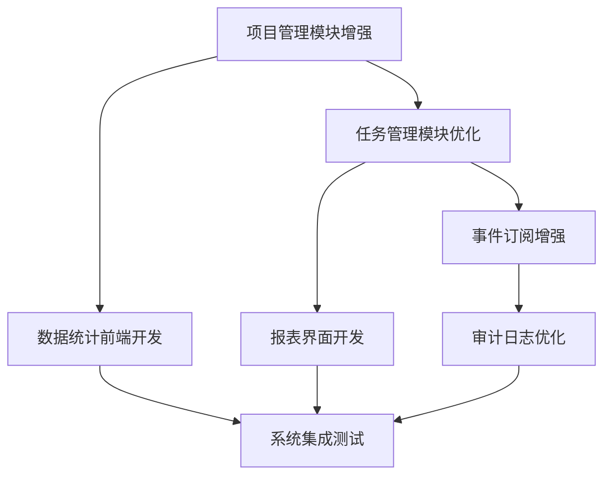

# Iteration 2 敏捷项目管理计划

## 项目基本信息
项目名称: OpenClaw AI Agent专属项目管理系统
迭代编号: Iteration 2 (v1.1)
开始日期: 2026年3月27日
结束日期: 2026年4月2日
迭代时长: 7 天

## 迭代目标
增强系统功能，提升用户体验，完成v1.1版本交付
完成产品待办列表中 P1 优先级的 11 个用户故事
实现数据统计和报表功能
优化系统性能和用户体验
修复迭代1发现的问题

## 产品待办列表 (Product Backlog)
迭代2 用户故事

| 用户故事 | 功能域 | 负责人 | 预估工时 | 状态 |
|---------|--------|--------|----------|------|
| US002 | 项目管理 | 后端开发 | 2天 | 待开始 |
| US003 | 项目管理 | 后端开发 | 2天 | 待开始 |
| US008 | 任务管理 | 后端开发 | 1天 | 待开始 |
| US009 | 任务管理 | 后端开发 | 1天 | 待开始 |
| US011 | 事件订阅 | 后端开发 | 1天 | 待开始 |
| US015 | 可视化监控 | 前端开发 | 2天 | 待开始 |
| US016 | 数据统计 | 前端开发 | 2天 | 待开始 |
| US018 | 审计与合规 | 后端开发 | 1天 | 待开始 |
| US019 | 审计与合规 | 后端开发 | 1天 | 待开始 |
| US021 | 数据统计 | 后端开发 | 1天 | 待开始 |
| US022 | 数据统计 | 后端开发 | 1天 | 待开始 |

## 任务拆解
### 后端开发任务 (Backend)
US002 - 项目管理：项目成员管理
US003 - 项目管理：项目权限配置
US008 - 任务管理：任务批量操作
US009 - 任务管理：任务标签管理
US011 - 事件订阅：事件通知配置
US018 - 审计与合规：审计日志查询
US019 - 审计与合规：系统操作日志
US021 - 数据统计：任务完成率统计
US022 - 数据统计：工时统计

### 前端开发任务 (Frontend)
US015 - 可视化监控：数据报表界面
US016 - 数据统计：统计图表展示

### 设计任务 (Design)
UI设计稿：数据统计页面
UI设计稿：报表导出功能
交互设计：批量操作流程

### 测试任务 (Testing)
测试计划：Iteration 2 测试计划
功能测试：增强功能测试
接口测试：API接口优化测试
性能测试：系统性能优化

## 依赖关系

## 风险识别和应对
| 风险 | 发生概率 | 影响程度 | 应对措施 | 负责人 |
|------|----------|----------|----------|--------|
| 需求变更 | 高 | 中 | 建立变更控制流程，评估变更影响 | 产品经理 |
| 开发延期 | 中 | 高 | 优化任务分解，合理安排资源 | 项目负责人 |
| 技术风险 | 低 | 高 | 提前技术选型，制定技术方案 | 技术负责人 |
| 质量问题 | 低 | 中 | 建立测试流程，严格质量控制 | 测试工程师 |

## 质量目标
代码质量：通过代码审查和静态分析工具确保代码质量
功能覆盖：所有用户故事都有对应的测试用例
性能目标：响应时间 < 500ms
安全性：实现数据加密和访问控制
代码标准：遵循团队代码规范，代码注释率≥30%，单元测试覆盖率≥60%

## 交付物
前端代码：实现数据统计和报表功能
后端代码：实现系统增强功能的后端服务
数据库设计文档：系统数据库优化设计
API接口文档：系统API接口规范更新
测试计划和用例：Iteration 2 测试计划和测试用例
部署文档：系统部署方案更新
用户手册：系统操作手册更新

## 验收标准
所有用户故事都已实现
代码通过代码审查
测试覆盖率达到80%以上
系统能够正常运行和部署
功能测试100%通过
性能测试达标（响应时间≤500ms）
用户验收通过

## 团队成员和职责
| 角色 | 姓名 | 职责 |
|------|------|------|
| 前端高级开发工程师 | 李四 | 负责前端开发工作 |
| 后台高级开发工程师 | 张三 | 负责后端开发工作 |
| 高级测试工程师 | 赵六 | 负责测试工作 |
| 高级产品经理 | Jack | 负责产品设计和需求分析 |
| 高级设计师 | 王五 | 负责UI设计工作 |

## 每日站会安排
时间：每天上午 09:30
地点：飞书群聊
时长：15分钟
内容：
- 昨天完成的工作
- 今天计划完成的工作
- 遇到的问题和困难
- 需要的支持和帮助
输出：站会记录

## 评审会议安排
代码审查：每日提交代码后进行
接口评审：每周二、周四下午 14:00
需求评审：迭代开始前和需求变更时
迭代评审：2026年4月2日下午，展示功能增强版、收集反馈、调整需求
迭代回顾：2026年4月2日下午，总结迭代经验、识别改进点、制定改进计划

## 变更管理流程
提交变更申请
评估变更影响
变更审批
实施变更
变更验证

## 结束条件
所有用户故事都已完成
产品负责人确认验收通过
客户验收通过
文档齐全，符合规范

文档创建时间: 2026-03-15
文档版本: v1.1
文档状态: 已更新
