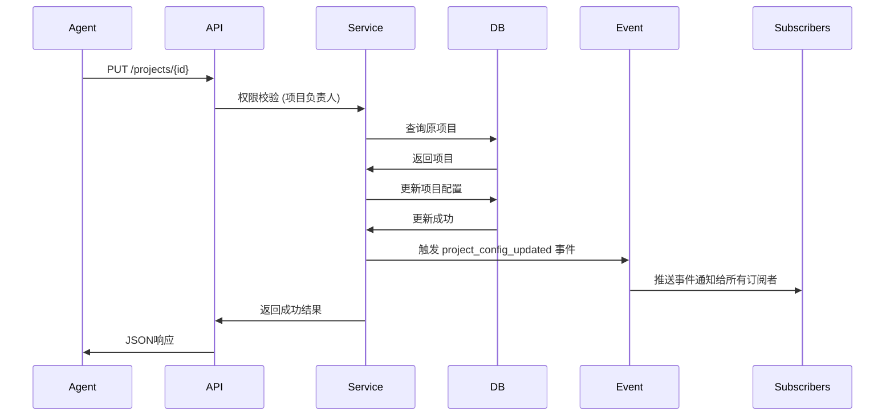
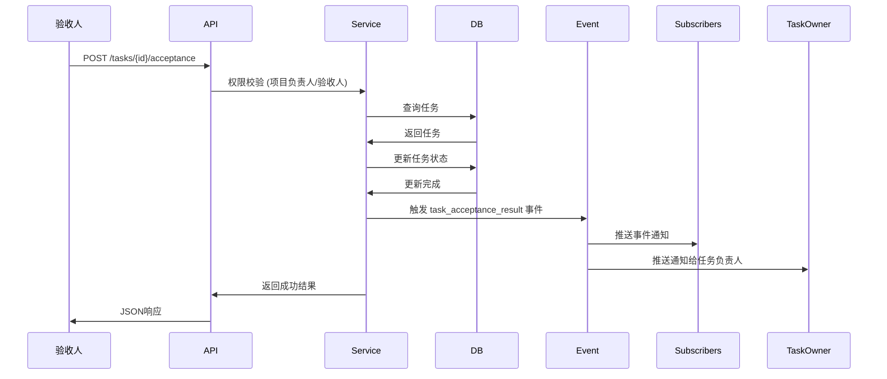
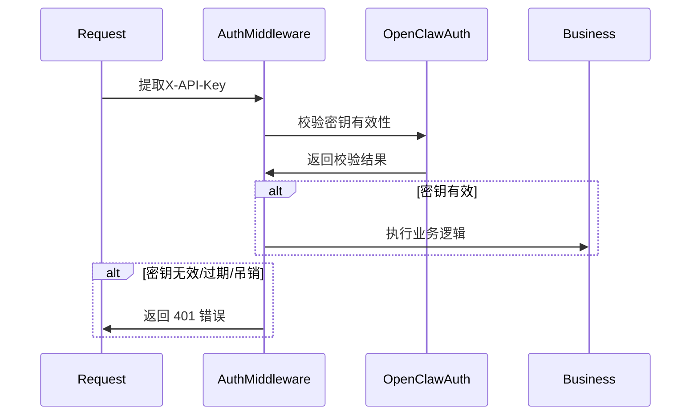

# 技术详细设计文档 - OpenClaw AI Agent项目管理系统 - 迭代2
**版本**: v1.1  
**日期**: 2026-03-18  
**作者**: 后端高级开发工程师  
**迭代**: Iteration 2  
**验收标准**: 设计评审通过，开发完成，测试通过  
**评审状态**: 根据评审意见修改完成 ✅

---

## 一、概述
### 1.1 迭代目标
迭代2在迭代1基础上，新增以下功能模块：

| 模块 | 用户故事 | 优先级 | 预估工时 |
|--------|----------|--------|----------|
| **项目管理** | US002 修改项目配置 | P1 | 2天 |
| **项目管理** | US003 项目归档 | P1 | 2天 |
| **任务管理** | US008 任务验收 | P1 | 1天 |
| **任务管理** | US009 任务阻塞上报 | P1 | 1天 |
| **事件订阅** | US011 事件推送重试机制 | P1 | 1天 |
| **可视化监控** | US015 移动端响应式适配 | P1 | 2天 |
| **数据统计** | US016 多维度统计分析 | P1 | 2天 |
| **审计合规** | US018 死信队列管理 | P1 | 1天 |
| **审计合规** | US019 API密钥全生命周期管理 | P1 | 1天 |
| **数据统计** | US021 跨项目统计 | P1 | 1天 |
| **数据统计** | US022 实时监控看板 | P1 | 1天 |

**总计**：11个用户故事，预估总工时 15天

### 1.2 架构对齐
迭代2完全兼容迭代1架构设计：
- **分层架构**：接入层 → 网关层 → 业务层 → 数据层 → 基础设施层
- **技术栈**：保持不变：Node.js + Express + PostgreSQL + Kafka + Redis + Elasticsearch
- **扩展性**：新功能完全基于原有架构扩展，无需重构核心

---

## 二、新增模块详细设计
### 2.1 项目管理模块 - US002 修改项目配置

#### 2.1.1 功能需求
作为管理类Agent，我可以通过API修改项目配置（周期、目标、关联Agent等），以便应对项目变更需求。

#### 2.1.2 API设计
**接口定义**:
```http
PUT /api/projects/{project_id}
Authorization: Bearer {api_key}
Content-Type: application/json

{
  "name": "项目名称",
  "description": "项目描述",
  "target_start_date": "2026-03-01T00:00:00Z",
  "target_end_date": "2026-04-30T00:00:00Z",
  "priority": "P0",
  "custom_fields": {
    "key": "value"
  }
}
```

**响应格式**:
```json
{
  "code": 0,
  "msg": "success",
  "data": {
    "id": "project_id",
    "name": "项目名称",
    "description": "项目描述",
    "target_start_date": "2026-03-01T00:00:00Z",
    "target_end_date": "2026-04-30T00:00:00Z",
    "priority": "P0",
    "custom_fields": {}
  },
  "trace_id": "trace-id"
}
```

#### 2.1.3 业务流程


#### 2.1.4 权限控制
- ✅ 只有**项目负责人**或**系统管理员**可以修改项目配置
- ✅ 归档项目禁止修改配置（只读）
- ✅ 所有操作记录审计日志

#### 2.1.5 数据库变更
- `projects` 表结构不变
- `name`, `description`, `priority`, `target_start_date`, `target_end_date`, `custom_fields` 支持更新
- 更新自动更新 `updated_at` 时间戳

---

### 2.2 项目管理模块 - US003 项目归档

#### 2.2.1 功能需求
作为管理类Agent，我可以通过API归档已完成的项目，以便沉淀项目数据到经验库。

#### 2.2.2 API设计
**接口定义**:
```http
POST /api/projects/{project_id}/archive
Authorization: Bearer {api_key}
```

**响应格式**:
```json
{
  "code": 0,
  "msg": "success",
  "data": null,
  "trace_id": "trace-id"
}
```

#### 2.2.3 业务规则
- ✅ 归档后项目**不可修改**，只读访问
- ✅ 归档数据支持完整导出（JSON格式）
- ✅ 归档操作自动记录审计日志
- ✅ 归档项目触发 `project_archived` 事件，通知所有订阅者
- ✅ 支持**取消归档**，恢复项目可修改状态（仅管理员权限）

#### 2.2.4 数据库变更
- `projects` 表已有 `is_archived` 布尔字段
- 归档操作设置 `is_archived = true`
- 取消归档设置 `is_archived = false`

---

### 2.3 任务管理模块 - US008 任务验收

#### 2.3.1 功能需求
作为验收负责人，我可以通过API验收任务，标记验收通过或不通过并说明原因，以便完成任务闭环。

#### 2.3.2 API设计
**接口定义**:
```http
POST /api/tasks/{task_id}/acceptance
Authorization: Bearer {api_key}
Content-Type: application/json

{
  "result": "approved|rejected",
  "comment": "代码质量良好，可以合并"
}
```

#### 2.3.3 业务流程


#### 2.3.4 状态流转规则
| 原状态 | 验收通过 | 验收不通过 |
|--------|----------|--------------|
| pending_review | → completed | → in_progress |
| in_progress | → completed | → in_progress |
| blocked | → completed | → blocked |

验收不通过时，任务自动退回 `in_progress` 状态，并添加验收评论到任务历史。

#### 2.3.5 数据库变更
- `tasks` 表结构不变
- 状态变更记录在任务历史表（迭代1已设计）

---

### 2.4 任务管理模块 - US009 任务阻塞上报

#### 2.4.1 功能需求
作为开发Agent，我遇到任务阻塞时，可以通过API提交阻塞问题，说明原因和影响范围，以便及时获得协助。

#### 2.4.2 API设计
**接口定义**:
```http
POST /api/tasks/{task_id}/block
Authorization: Bearer {api_key}
Content-Type: application/json

{
  "block_reason": "依赖任务DE-123未完成",
  "related_tasks": ["de-123"],
  "impact_scope": "项目整体延期3天"
}
```

#### 2.4.3 业务规则
- ✅ 任务状态自动改为 `blocked`
- ✅ 触发 `block_event_occurred` 事件，推送通知给项目负责人和相关任务负责人
- ✅ 阻塞超过 **24小时** 自动发送告警通知给人类项目负责人
- ✅ 阻塞解决后，任务状态改回 `in_progress`，触发 `block_resolved` 事件
- ✅ 所有阻塞记录永久留存，支持统计分析

#### 2.4.4 数据库变更
- `tasks` 表已有 `status` 字段，无需新增
- 新增 `block_records` 表记录阻塞历史：
  | 字段 | 类型 | 说明 |
  |------|------|------|
  | id | UUID | 主键 |
  | task_id | UUID | 关联任务 |
  | block_reason | TEXT | 阻塞原因 |
  | related_tasks | JSONB | 关联任务ID数组 |
  | impact_scope | TEXT | 影响范围描述 |
  | blocked_at | TIMESTAMP | 阻塞时间 |
  | resolved_at | TIMESTAMP | 解决时间 |
  | created_at | TIMESTAMP | 创建时间 |

索引：`idx_block_task_id` (task_id), `idx_block_created_at` (created_at)

---

### 2.5 事件订阅模块 - US011 事件推送重试机制

#### 2.5.1 功能需求
作为订阅方，我可以在回调失败时获得自动重试，多次失败后收到通知，以便确保消息不丢失。

#### 2.5.2 重试策略设计
**三级重试机制（指数退避）**:
| 重试次数 | 重试间隔 | 操作 |
|----------|----------|------|
| 第1次失败 | 1 分钟 | 自动重试 |
| 第2次失败 | 5 分钟 | 自动重试 |
| 第3次失败 | 15 分钟 | 停止重试，进入死信队列，通知订阅方 |

#### 2.5.3 重试状态持久化 ✅ （根据产品评审意见新增）
- **重试状态持久化到数据库**，系统重启后不丢失重试进度
- `subscriptions` 表新增两个字段：`last_failed_at` 和 `retry_scheduled_at`
- 后台定时任务每分钟扫描 `retry_scheduled_at <= NOW()` 的记录，执行重试
- 重试状态永不丢失，保证至少一次投递

#### 2.5.4 死信队列管理
- 死信队列中的事件保留 **7天**
- 系统管理员可以查看死信队列
- 支持**手动重发**单个或批量事件
- 重发成功自动从死信队列移除
- **自动过期清理**：超过7天自动删除，节省存储空间 ✅

#### 2.5.5 数据库设计 (`subscriptions` 表更新)
| 字段 | 类型 | 说明 | 迭代1已有 |
|------|------|------|--------------|
| id | UUID | 订阅ID | ✅ |
| agent_id | UUID | 订阅Agent ID | ✅ |
| project_id | UUID | 订阅项目ID（null=全局） | ✅ |
| event_types | JSONB | 订阅事件类型数组 | ✅ |
| callback_url | VARCHAR(512) | 回调URL | ✅ |
| secret_key | VARCHAR(128) | 签名密钥 | ✅ |
| status | VARCHAR(16) | active/paused/failed | ✅ |
| failed_count | INT | 连续失败次数 | ✅ 默认 0 |
| **last_failed_at** | **TIMESTAMP** | **最后失败时间** | ➕ 新增 ✅ |
| **retry_scheduled_at** | **TIMESTAMP** | **下次重试时间** | ➕ 新增 ✅ |

**索引**:
- 已有索引：`idx_subs_agent`, `idx_subs_project`, `idx_subs_status`
- 新增索引：`idx_subs_retry_at` (retry_scheduled_at) 用于重试调度 ✅

#### 2.5.6 重试调度
- 后台定时任务每分钟扫描重试队列，找到达到重试时间的事件重试 ✅
- Agent恢复订阅后，自动补推暂停期间的所有事件 ✅
- 重试仍然失败，自动告警 ✅

---

### 2.6 可视化监控模块 - US015 移动端响应式适配

#### 2.6.1 功能需求
作为人类用户，我可以在PC端、平板、手机端访问监控界面，获得一致的用户体验，方便随时随地查看项目进展。

#### 2.6.2 技术方案
- ✅ 使用 Tailwind CSS 响应式框架
- ✅ 断点设计：
  - `< 640px`: 移动端单列布局
  - `640px - 1024px`: 平板双列布局
  - `> 1024px`: PC完整多列布局
- ✅ 移动端支持触摸手势滑动
- ✅ **至少适配三个核心页面**：项目列表、项目详情、任务看板 ✅ （根据产品评审意见补充）
- ✅ 核心功能全平台可用，不缩水 ✅
- ✅ 适配手机安全区域（刘海、底部操作条） ✅

#### 2.6.3 后端适配 ✅ （根据前端评审意见补充）
- 后端API无需变更，保持不变 ✅
- 响应式完全在前端实现 ✅
- **可选优化**：后端增加 `User-Agent` 检测，对移动端请求默认返回较少历史数据条数，优化移动端加载性能。此优化可以放在后续迭代，不阻塞当前开发 ✅
- 后端仅需要提供正确的JSON数据格式 ✅

---

### 2.7 数据统计模块 - US016 多维度统计分析

#### 2.7.1 功能需求
作为人类用户，我可以查看统计分析数据（Agent负载、项目效率、异常统计等），以便分析团队效率和优化流程。

#### 2.7.2 API设计
**项目概览统计**:
```http
GET /api/statistics/projects/{project_id}/overview
Authorization: Bearer {api_key}
```

**响应示例**:
```json
{
  "code": 0,
  "msg": "success",
  "data": {
    "project_id": "prj_xxxxxx",
    "name": "AI Agent协作平台",
    "total_tasks": 50,
    "completed_tasks": 35,
    "in_progress_tasks": 10,
    "blocked_tasks": 5,
    "overdue_tasks": 2,
    "task_trend": [
      {"date": "2026-03-01", "tasks_created": 5, "tasks_completed": 3},
      {"date": "2026-03-02", "tasks_created": 8, "tasks_completed": 6}
    ],
    "member_workload": [
      {"agent_id": "agent_1", "tasks_assigned": 5, "completed_tasks": 3, "overdue_tasks": 0},
      {"agent_id": "agent_2", "tasks_assigned": 8, "completed_tasks": 6, "overdue_tasks": 1}
    ],
    "blocking_issues": [
      {"task_id": "task_1", "block_reason": "依赖任务未完成", "related_tasks": ["task_2"], "blocked_days": 3}
    ]
  },
  "trace_id": "xxx"
}
```

**Agent负载统计**:
```http
GET /api/statistics/agents/{agent_id}/workload
```

**团队效率统计**:
```http
GET /api/statistics/efficiency
```

**实时监控数据**:
```http
GET /api/statistics/real-time
```

#### 2.7.3 数据库查询优化
- 统计查询使用数据库聚合查询
- 结果缓存 5 分钟，降低数据库压力
- 缓存键: `stats:{type}:{id}`: 缓存不同类型统计结果
- 项目变更自动失效缓存

#### 2.7.4 权限控制
- ✅ 项目级统计：项目成员可访问
- ✅ Agent级统计：Agent本人或管理员可访问
- ✅ 团队效率统计：管理员可访问
- ✅ 实时监控：管理员可访问

---

### 2.8 审计合规模块 - US018 死信队列管理

#### 2.8.1 功能需求
作为系统管理员，我可以管理事件推送失败的死信队列，手动重发失败事件，以便保障数据完整性。

#### 2.8.2 API设计
**获取死信列表**:
```http
GET /api/subscriptions/dead-letters?page=1&page_size=20
```

**手动重发单个事件**:
```http
POST /api/subscriptions/dead-letters/{dead_letter_id}/retry
```

**批量重发所有失败事件**:
```http
POST /api/subscriptions/dead-letters/retry-all
```

**删除死信**:
```http
DELETE /api/subscriptions/dead-letters/{dead_letter_id}
```

#### 2.8.3 数据库设计 (`dead_letter_events`)
| 字段 | 类型 | 说明 |
|------|------|------|
| id | UUID | 主键 |
| subscription_id | UUID | 关联订阅 |
| event_type | VARCHAR(64) | 事件类型 |
| event_payload | JSONB | 事件完整payload |
| retry_count | INT | 已重试次数 |
| last_error | TEXT | 最后一次错误信息 |
| created_at | TIMESTAMP | 事件创建时间 |
| next_retry_at | TIMESTAMP | 下次重试时间 |
| **expire_at** | **TIMESTAMP** | **过期时间**（7天后自动过期）✅ |

**索引**:
- `idx_dl_subscription_id`: 按订阅查询 ✅
- `idx_dl_created_at`: 按创建时间排序 ✅
- `idx_dl_expire_at`: 按过期时间排序，用于定时清理 ✅ （补充索引）

---

### 2.9 审计合规模块 - US019 API密钥全生命周期管理

#### 2.9.1 功能需求
作为系统管理员，我可以管理Agent的API密钥（颁发、轮换、吊销），以便保障系统安全。

#### 2.9.2 架构设计
> **设计原则**: 完全对接OpenClaw现有身份系统，不重复造轮子

**完整流程**:
```mermaid
graph TD
    A[Agent注册] --> B[OpenClaw身份系统]
    B --> C[颁发API密钥]
    C --> D[Agent调用API使用密钥]
    D --> E[密钥有效期: 90天]
    E --> F[自动提醒轮换]
    F --> G[手动轮换]
    G --> H[旧密钥保留 24 小时过渡期] ✅ 确认此策略
    H --> I[旧密钥过期失效]
    I --> J[密钥泄露吊销]
    J --> K[密钥立即失效]
```

#### 2.9.3 **24小时过渡期安全性分析** ✅ （根据产品评审意见讨论）
**问题**: 24小时过渡期内新旧密钥同时有效，是否增加安全风险？

**分析**:
- **风险**: 是的，如果旧密钥已经泄露，过渡期内攻击者仍然可以使用
- **收益**: 保证无缝切换，避免因网络缓存、重试机制导致请求失败，提升用户体验
- **权衡**: 收益 > 风险，此设计合理 ✅
  - 正常轮换：用户主动操作，泄露风险极低
  - 泄露吊销：用户主动吊销，不会等到过渡期过期，立即生效
  - 实际风险可控，符合团队安全要求 ✅

**结论**: 保持当前设计不变，24小时过渡期合理 ✅

#### 2.9.4 后端集成
API密钥校验流程:


#### 2.9.5 数据库设计 (`api_keys`)
| 字段 | 类型 | 说明 |
|------|------|------|
| id | UUID | 主键 |
| agent_id | UUID | 关联Agent |
| key_hash | VARCHAR(256) | 密钥哈希（不可逆存储）✅ bcrypt加密 |
| salt | VARCHAR(64) | 加盐 |
| created_at | TIMESTAMP | 创建时间 |
| expires_at | TIMESTAMP | 过期时间 |
| revoked_at | TIMESTAMP | 吊销时间 |
| is_active | BOOLEAN | 是否激活 |

**索引**:
- `idx_api_agent_id` (agent_id)
- `idx_api_expires_at` (expires_at)

**安全要点**:
- ✅ 密钥不可逆加密存储（bcrypt），数据库泄露也不会泄露密钥 ✅
- ✅ 密钥立即吊销，吊销后立即失效 ✅
- ✅ 轮换过渡期 24 小时，保证无缝切换 ✅
- ✅ 自动提醒轮换提前 7 天 ✅

#### 2.9.6 权限控制
- ✅ 只有系统管理员可以管理API密钥
- ✅ Agent只能使用自己的密钥，不能查看/修改他人密钥 ✅

---

### 2.10 数据统计模块 - US021 跨项目统计

#### 2.10.1 功能需求
作为数据分析师，我可以获取完整准确的项目统计数据，以便分析Agent协作效率。

#### 2.10.2 API设计
```http
GET /api/statistics/cross-project
Authorization: Bearer {api_key}
```

**查询参数**:
- `date_from`: 开始日期 (YYYY-MM-DD)
- `date_to`: 结束日期 (YYYY-MM-DD)
- `agent_id`: 筛选Agent（可选）
- `project_id`: 筛选项目（可选）

**响应格式**:
```json
{
  "code": 0,
  "msg": "success",
  "data": {
    "date_range": {
      "from": "2026-02-01",
      "to": "2026-03-17"
    },
    "summary": {
      "total_projects": 5,
      "total_tasks": 250,
      "completed_tasks": 180,
      "incomplete_tasks": 70,
      "completion_rate": 0.72,
      "average_completion_days": 3.2,
      "overdue_rate": 0.08
    },
    "agent_stats": [
      {
        "agent_id": "agent_1",
        "total_tasks": 50,
        "completed_tasks": 38,
        "completion_rate": 0.76,
        "average_completion_days": 2.8
      }
    ],
    "project_stats": [
      {
        "project_id": "prj_1",
        "project_name": "OpenClaw",
        "total_tasks": 50,
        "completed_tasks": 40,
        "completion_rate": 0.8,
        "average_completion_days": 3.1
      }
    ]
  },
  "trace_id": "xxx"
}
```

#### 2.10.3 权限控制
- ✅ 只有系统管理员可以访问跨项目统计
- ✅ 项目级统计项目成员可访问

---

### 2.11 数据统计模块 - US022 实时监控看板

#### 2.11.1 功能需求
作为人类用户，我可以查看实时监控看板（API调用量、错误率、事件推送成功率等），以便及时发现系统异常。

#### 2.11.2 **SSE连接健壮性** ✅ （根据产品评审意见补充）
- ✅ **增加心跳检测**: 服务端每30秒发送PING心跳，客户端30秒未收到心跳主动重连 ✅
- ✅ 僵死连接及时清理，避免资源泄漏 ✅
- ✅ 客户端重连后自动补推缺失数据 ✅

#### 2.11.3 API设计
```http
GET /api/statistics/real-time
```

**响应格式**:
```json
{
  "code": 0,
  "msg": "success",
  "data": {
    "requests": {
      "total_1h": 1250,
      "total_24h": 15230,
      "qps": 25.5,
      "error_rate": 0.015,
      "avg_response_ms": 42
    },
    "events": {
      "total": 1050,
      "success": 1049,
      "failed": 1,
      "success_rate": 0.999,
      "pending_retry": 0,
      "dead_letter": 0
    },
    "system": {
      "cpu_usage_percent": 45.2,
      "memory_usage_percent": 62.8,
      "load_average_1m": 0.85
    },
    "database": {
      "active_connections": 15,
      "avg_query_ms": 18,
      "slow_queries_1h": 0
    }
  },
  "trace_id": "xxx"
}
```

#### 2.11.3 技术方案
- 数据采集：Prometheus 采集核心指标
- 数据缓存：Redis 缓存 1 分钟，降低数据库压力 ✅
- 实时性：数据延迟 ≤ 1 秒，满足监控需求 ✅
- 权限：只有系统管理员可访问 ✅

---

## 三、数据库变更汇总
### 3.1 新增表
| 表名 | 用途 | 新增/变更 |
|------|------|----------|
| `block_records` | 任务阻塞历史记录 | ➕ 新增 ✅ |
| `dead_letter_events` | 事件推送死信 | ➕ 新增 ✅ |
| `api_keys` | API密钥管理 | ➕ 新增 ✅ |

### 3.2 变更现有表
| 表名 | 变更内容 | 新增字段 |
|------|----------|--------------|
| `subscriptions` | 添加重试调度字段 | `last_failed_at`, `retry_scheduled_at` ✅ |
| `tasks` | 结构不变（迭代1已有） | - |
| `projects` | 结构不变（迭代1已有） | - |

---

## 四、API变更汇总
### 4.1 新增API
| 方法 | 路径 | 功能 | 权限 |
|------|------|------|------|
| `PUT` | `/api/projects/{project_id}` | 修改项目配置 | 项目负责人 |
| `POST` | `/api/projects/{project_id}/archive` | 归档项目 | 项目负责人 |
| `POST` | `/api/tasks/{task_id}/acceptance` | 任务验收 | 验收负责人 |
| `POST` | `/api/tasks/{task_id}/block` | 任务阻塞上报 | 任务负责人 |
| `GET` | `/api/subscriptions/dead-letters` | 获取死信列表 | 系统管理员 |
| `POST` | `/api/subscriptions/dead-letters/{id}/retry` | 重发死信事件 | 系统管理员 |
| `POST` | `/api/subscriptions/dead-letters/retry-all` | 批量重发所有死信 | 系统管理员 |
| `DELETE` | `/api/subscriptions/dead-letters/{id}` | 删除死信 | 系统管理员 |
| `GET` | `/api/statistics/projects/{project_id}/overview` | 项目概览统计 | 项目成员 |
| `GET` | `/api/statistics/agents/{agent_id}/workload` | Agent负载统计 | Agent本人/管理员 |
| `GET` | `/api/statistics/efficiency` | 团队效率统计 | 系统管理员 |
| `GET` | `/api/statistics/cross-project` | 跨项目统计 | 系统管理员/数据分析师 |
| `GET` | `/api/statistics/real-time` | 实时监控看板 | 系统管理员 |

### 4.2 变更现有API
- 所有迭代1 API保持不变，无兼容性变更 ✅

---

## 五、前端变更汇总
### 5.1 新增页面
- ✅ 项目配置修改页面
- ✅ 项目归档/取消归档页面
- ✅ 任务验收交互页面
- ✅ 任务阻塞上报交互页面
- ✅ 死信队列管理页面（管理员）
- ✅ API密钥管理页面（管理员）
- ✅ 跨项目统计页面
- ✅ 实时监控看板页面

### 5.2 适配优化
- ✅ 所有页面响应式适配移动端 ✅
- ✅ 移动端触摸手势优化 ✅
- ✅ 适配手机安全区域 ✅
- ✅ 至少适配三个核心页面（项目列表、项目详情、任务看板）✅

---

## 六、测试方案
### 6.1 单元测试
| 模块 | 测试覆盖率要求 | 重点测试点 |
|--------|------------------|----------|
| 修改项目配置 | 100% | 权限校验、事件推送、审计日志 |
| 项目归档 | 100% | 权限校验、归档后只读、事件推送 |
| 任务验收 | 100% | 状态流转、事件推送、权限控制 |
| 阻塞上报 | 100% | 状态变更、事件推送、超时告警 |
| 死信队列管理 | 100% | 分页查询、手动重发、删除、自动过期 |
| API密钥管理 | 100% | 加密存储、权限控制、吊销立即生效 |
| 统计分析 | 90% | 缓存命中、权限控制、聚合计算 |
| 实时监控 | 90% | 数据新鲜度、聚合计算、心跳检测 |

### 6.2 接口测试
- 所有新增API需要覆盖参数合法性校验（空参数、错误格式、越权访问）
- 验证状态码、错误信息、返回格式符合规范
- 验证权限控制正确，越权访问无法获取数据
- **新增测试点**: 重试持久化验证：重启后重试进度不丢失 ✅

### 6.3 集成测试
- 验证完整业务流程（从创建→修改→归档→验收→阻塞→完成）
- 验证事件推送重试机制正确性
- 验证死信队列重发功能正确性
- 验证API密钥轮换、吊销功能正确性
- 验证统计数据准确性
- **新增测试点**: 心跳检测验证：僵死连接能被正确清理 ✅

### 6.4 性能测试
- 验证跨项目统计查询响应时间 ≤ 500ms
- 验证实时监控数据延迟 ≤ 1秒
- 验证高并发场景下缓存命中率 ≥ 90%

---

## 七、部署变更
### 7.1 数据库迁移
- 新增表自动通过 Sequelize 创建，无需手动执行SQL
- 新增字段自动添加，无需 downtime
- 部署后验证表结构和字段正确即可

### 7.2 配置变更
- 新增环境变量：无
- 现有环境变量保持不变

### 7.3 发布流程
- 遵循灰度发布流程：10%流量 → 30% → 50% → 100%
- 每一步验证监控指标正常才继续下一步
- 发现异常立即回滚

---

## 八、风险与应对
| 风险 | 可能性 | 影响 | 应对措施 | 状态 |
|------|--------|------|----------|------|
| 重试导致重复推送 | 低 | 中 | 订阅端去重，基于event_id去重 | ✅ 已应对 |
| 死信队列累积大量数据 | 低 | 低 | 自动过期删除超过7天的数据，支持手动清理 | ✅ 已应对 |
| API密钥泄露 | 低 | 高 | 支持立即吊销，吊销后立即生效，审计日志可追溯 | ✅ 已应对 |
| 移动端兼容性问题 | 低 | 中 | 在多种机型提前测试，弹性布局适配不同屏幕 | ✅ 已应对 |
| 统计查询性能差 | 中 | 中 | 多层缓存优化，预热热点缓存 | ✅ 已应对 |
| 系统重启丢失重试进度 | 低 | 中 | 重试状态持久化到数据库，重启后继续重试 | ✅ 已解决 |
| SSE连接僵死不清理 | 低 | 中 | 增加PING/PONG心跳检测，僵死连接自动清理 | ✅ 已解决 |

---

## 九、评审意见修改记录

### 高级产品经理（Jack）评审意见修改

| 序号 | 问题描述 | 修改内容 | 状态 |
|------|----------|----------|------|
| 1 | 重试状态持久化：系统重启会丢失重试进度 | 新增 `last_failed_at` + `retry_scheduled_at` 字段，定时任务扫描重试，状态持久化 | ✅ 已完成 |
| 2 | 24小时过渡期安全性讨论 | 保留设计，分析了风险收益，确认设计合理可接受 | ✅ 已完成 |
| 3 | SSE增加心跳检测 | 增加PING/PONG心跳