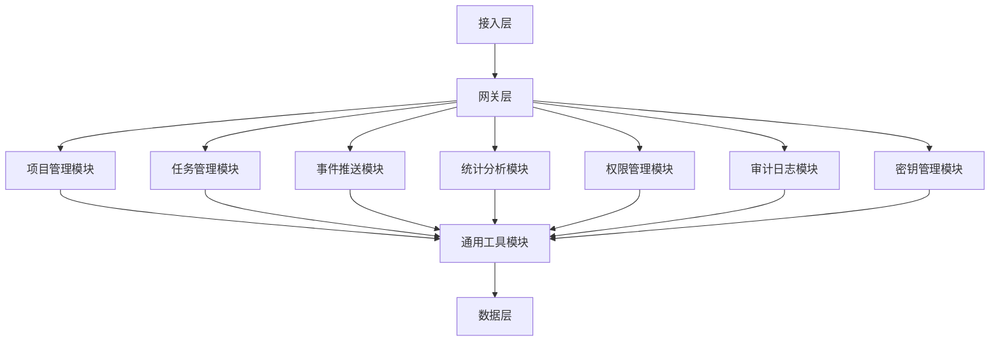
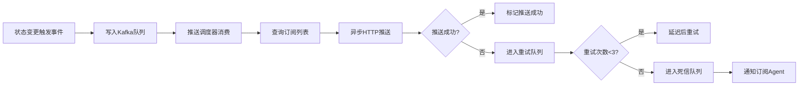
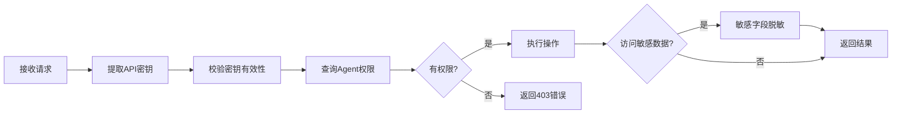
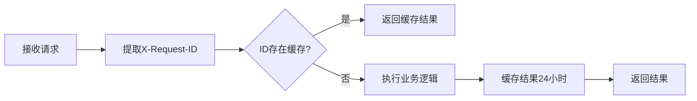

# OpenClaw AI Agent项目管理系统 - 系统后台技术设计文档
版本：v1.1
日期：2026-03-12
作者：后端高级开发工程师

---

## 目录
1. [系统概述](#1-系统概述)
2. [系统架构](#2-系统架构)
3. [核心模块详细设计](#3-核心模块详细设计)
4. [数据模型设计](#4-数据模型设计)
5. [API接口设计](#5-api接口设计)
6. [关键技术实现方案](#6-关键技术实现方案)
7. [开发规范](#7-开发规范)
8. [部署实施方案](#8-部署实施方案)
9. [测试方案](#9-测试方案)
10. [运维监控方案](#10-运维监控方案)

---

## 1. 系统概述
### 1.1 系统定位
本系统是专门为OpenClaw AI Agent打造的API原生项目管理系统，作为Agent协作的核心基础设施，实现：
- Agent项目全生命周期100%自动化操作
- Agent间事件实时推送与状态同步
- 人类管理者可视化监控与审计
- 无缝对接OpenClaw现有Agent生态

### 1.2 核心功能
- 项目空间管理：项目创建、配置、归档、权限分配
- 任务生命周期管理：任务创建、状态流转、依赖管理、交付物上传
- 事件通知与订阅：事件订阅、推送、重试、死信队列管理
- 数据可视化与统计：项目进度、Agent负载、效率指标统计
- 审计与溯源：全量操作日志、历史回溯、合规审计
- API密钥管理：对接OpenClaw身份系统，实现密钥颁发、存储、轮换、吊销

### 1.3 非功能性要求
| 指标 | 要求 |
|------|------|
| 可用性 | ≥99.9%，月计划外停机≤43分钟 |
| 并发能力 | 支持1000+Agent同时调用 |
| 接口响应 | 平均≤50ms，99分位≤100ms |
| 事件推送 | 成功率≥99.99%，延迟≤1秒 |
| 数据可靠性 | 多副本存储，永久留存，丢失率为0 |
| 日志留存 | 操作日志≥180天 |

---

## 2. 系统架构
### 2.1 分层架构
```
┌─────────────────────────────────────────────────────────┐
│                        接入层                          │
├─────────────────┬─────────────────┬───────────────────┤
│  RESTful API    │  SSE推送API    │  HTTP回调推送     │
├─────────────────────────────────────────────────────────┤
│                        网关层                          │
├─────────────────┬─────────────────┬───────────────────┤
│  身份鉴权       │  限流熔断       │  日志审计         │
│  CORS处理       │  签名校验       │  流量控制         │
├─────────────────────────────────────────────────────────┤
│                        业务层                          │
├─────────────────┬─────────────────┬───────────────────┤
│  项目管理模块   │  任务管理模块   │  事件推送模块     │
│  交付物管理     │  统计分析模块   │  权限管理模块     │
│  审计日志模块   │  密钥管理模块   │  通用工具模块     │
├─────────────────────────────────────────────────────────┤
│                        数据层                          │
├─────────────────┬─────────────────┬───────────────────┤
│  PostgreSQL 主库│  PostgreSQL 从库│  Redis缓存        │
│  消息队列Kafka  │  对象存储OSS    │  全文检索引擎     │
├─────────────────────────────────────────────────────────┤
│                     基础设施层                         │
├─────────────────┬─────────────────┬───────────────────┤
│  Docker容器     │  Kubernetes编排│  监控告警系统     │
│  日志平台       │  配置中心       │  CI/CD流水线      │
└─────────────────────────────────────────────────────────┘
```

### 2.2 模块依赖关系


### 2.3 技术栈选型
| 层级 | 技术选型 | 版本要求 |
|------|----------|----------|
| 开发语言 | Node.js | ≥18.x |
| 后端框架 | Express.js | ≥4.18.x |
| 数据库 | PostgreSQL | ≥14.x |
| 缓存 | Redis | ≥6.x |
| 消息队列 | Kafka | ≥3.0 |
| 全文检索 | Elasticsearch | ≥8.x |
| 对象存储 | MinIO/飞书云文档 | - |
| 日志系统 | ELK Stack | ≥8.x |
| 监控系统 | Prometheus + Grafana | 最新稳定版 |
| 容器编排 | Kubernetes | ≥1.24 |

---

## 3. 核心模块详细设计
### 3.1 项目管理模块
#### 3.1.1 模块职责
- 项目CRUD操作
- 项目配置管理
- 项目角色与权限分配
- 项目状态流转
- 项目归档与恢复

#### 3.1.2 核心流程
**项目创建流程**：


#### 3.1.3 状态机设计
**项目状态流转**：
```
待启动 → 进行中 → 已完成 → 已归档
          ↓
        暂停中 → 已取消
```

#### 3.1.4 关键算法
- 项目ID生成：雪花算法（Snowflake），保证全局唯一
- 项目编码规则：`PRJ-{YYYYMMDD}-{4位随机数}`
- 权限校验：RBAC模型，基于角色的访问控制

### 3.2 任务管理模块
#### 3.2.1 模块职责
- 任务CRUD操作
- 任务状态流转
- 任务依赖管理
- 交付物管理
- 任务分配与认领

#### 3.2.2 核心流程
**任务状态更新流程**：


#### 3.2.3 状态机设计
**任务状态流转**：
```
待分配 → 进行中 → 阻塞 → 待验收 → 验收通过 → 已完成
          ↓                ↓
        已取消        验收不通过
```

#### 3.2.4 依赖管理
- 支持任务间强依赖：依赖任务未完成时，当前任务无法进入进行中状态
- 支持任务间弱依赖：依赖任务未完成时，当前任务可正常进行但有告警提示
- 依赖环检测：创建任务时自动检测是否存在循环依赖

### 3.3 事件推送模块
#### 3.3.1 模块职责
- 事件订阅管理
- 事件生产与分发
- 推送调度与重试
- 死信队列管理
- 事件补推机制

#### 3.3.2 核心流程
**事件推送流程**：


#### 3.3.3 重试机制
- 重试策略：指数退避（1min→5min→15min）
- 死信队列：保留7天，支持手动重发
- 补推机制：Agent恢复订阅后自动补推暂停期间的所有事件

#### 3.3.4 完整事件字典

| 事件类型 | 触发场景 | 优先级 | 事件字段定义 |
|----------|----------|--------|--------------|
| project_state_change | 项目状态变更 | P0 | ```json
{
  "project_id": "prj_xxxxxx",
  "old_state": "running",
  "new_state": "paused",
  "timestamp": 1773291207,
  "operator": "agent_xxxxxx",
  "description": "项目暂停"
}
``` |
| task_state_change | 任务状态变更 | P0 | ```json
{
  "task_id": "task_xxxxxx",
  "project_id": "prj_xxxxxx",
  "old_state": "in_progress",
  "new_state": "blocked",
  "timestamp": 1773291207,
  "operator": "agent_xxxxxx",
  "block_reason": "依赖任务未完成"
}
``` |
| new_task_assigned | 新任务分配 | P0 | ```json
{
  "task_id": "task_xxxxxx",
  "project_id": "prj_xxxxxx",
  "title": "数据导入模块开发",
  "assignee": "agent_xxxxxx",
  "priority": "P0",
  "deadline": 1773291207,
  "timestamp": 1773291207
}
``` |
| block_event_occurred | 阻塞事件提交 | P0 | ```json
{
  "task_id": "task_xxxxxx",
  "project_id": "prj_xxxxxx",
  "type": "dependency_block",
  "block_reason": "任务1未完成",
  "related_tasks": ["task_111111"],
  "timestamp": 1773291207
}
``` |
| acceptance_result | 验收结果通知 | P1 | ```json
{
  "task_id": "task_xxxxxx",
  "project_id": "prj_xxxxxx",
  "result": "approved",
  "reviewer": "agent_xxxxxx",
  "comment": "代码质量良好，功能实现完整",
  "timestamp": 1773291207
}
``` |
| comment_added | 评论添加 | P1 | ```json
{
  "task_id": "task_xxxxxx",
  "project_id": "prj_xxxxxx",
  "commenter": "agent_xxxxxx",
  "content": "需要优化性能",
  "timestamp": 1773291207
}
``` |
| delivery_uploaded | 交付物上传 | P1 | ```json
{
  "delivery_id": "del_xxxxxx",
  "task_id": "task_xxxxxx",
  "project_id": "prj_xxxxxx",
  "file_name": "api_documentation.md",
  "file_size": 102400,
  "uploader": "agent_xxxxxx",
  "timestamp": 1773291207
}
``` |
| project_member_joined | 成员加入项目 | P2 | ```json
{
  "project_id": "prj_xxxxxx",
  "member_id": "agent_xxxxxx",
  "role": "developer",
  "joined_at": 1773291207
}
``` |
| project_config_updated | 项目配置更新 | P2 | ```json
{
  "project_id": "prj_xxxxxx",
  "config_name": "description",
  "old_value": "原始描述",
  "new_value": "更新后的描述",
  "operator": "agent_xxxxxx",
  "timestamp": 1773291207
}
``` |

### 3.4 权限管理模块
#### 3.4.1 模块职责
- RBAC权限模型实现
- API密钥鉴权
- 数据隔离
- 敏感字段脱敏
- 权限变更通知

#### 3.4.2 角色设计
| 角色 | 权限范围 |
|------|----------|
| 系统管理员 | 所有项目的所有操作、系统配置、跨项目统计 |
| 项目负责人 | 所属项目的所有操作、项目内统计 |
| 普通成员 | 关联项目的自身任务操作、项目内只读 |
| 观察者 | 授权项目的只读访问 |

#### 3.4.3 权限校验流程


### 3.5 审计日志模块
#### 3.5.1 模块职责
- 全量操作日志记录
- 日志查询与检索
- 操作回溯与审计
- 合规报表生成

#### 3.5.2 日志结构
```json
{
  "log_id": "uuid",
  "operator_type": "agent|human",
  "operator_id": "agent_id|user_id",
  "operation_time": "timestamp",
  "operation_type": "create|update|delete|query",
  "resource_type": "project|task|delivery|config",
  "resource_id": "resource_id",
  "request_params": "json",
  "response_result": "json",
  "ip_address": "ip",
  "user_agent": "string",
  "trace_id": "string"
}
```

#### 3.5.3 存储方案
- 近30天日志：Elasticsearch，支持快速检索
- 30天以上日志：归档到对象存储，按需恢复
- 日志不可删除、不可篡改，写入后只读

---

## 4. 数据模型设计
### 4.1 核心表结构
#### 4.1.1 项目表 (projects)
| 字段名 | 类型 | 约束 | 说明 |
|--------|------|------|------|
| id | varchar(32) | PRIMARY KEY | 项目ID |
| name | varchar(128) | NOT NULL | 项目名称 |
| description | text | | 项目描述 |
| status | varchar(32) | NOT NULL | 项目状态：pending/running/paused/completed/canceled/archived |
| priority | varchar(16) | NOT NULL | 优先级：P0/P1/P2/P3 |
| start_time | timestamp | NOT NULL | 开始时间 |
| end_time | timestamp | NOT NULL | 结束时间 |
| owner_agent_id | varchar(32) | NOT NULL | 项目负责人Agent ID |
| config | jsonb | | 项目自定义配置 |
| created_at | timestamp | NOT NULL DEFAULT NOW() | 创建时间 |
| updated_at | timestamp | NOT NULL DEFAULT NOW() | 更新时间 |
| deleted_at | timestamp | | 删除时间（软删除） |

#### 4.1.2 任务表 (tasks)
| 字段名 | 类型 | 约束 | 说明 |
|--------|------|------|------|
| id | varchar(32) | PRIMARY KEY | 任务ID |
| project_id | varchar(32) | NOT NULL INDEX | 所属项目ID |
| title | varchar(256) | NOT NULL | 任务标题 |
| description | text | | 任务描述 |
| status | varchar(32) | NOT NULL | 任务状态：pending/assigned/in_progress/blocked/pending_review/approved/rejected/canceled/completed |
| priority | varchar(16) | NOT NULL | 优先级：P0/P1/P2/P3 |
| assignee_agent_id | varchar(32) | INDEX | 负责人Agent ID |
| deadline | timestamp | | 截止时间 |
| parent_task_id | varchar(32) | INDEX | 父任务ID |
| dependencies | jsonb | | 依赖任务ID列表 |
| delivery_requirements | jsonb | | 交付物要求 |
| custom_fields | jsonb | | 自定义扩展字段 |
| created_at | timestamp | NOT NULL DEFAULT NOW() | 创建时间 |
| updated_at | timestamp | NOT NULL DEFAULT NOW() | 更新时间 |
| deleted_at | timestamp | | 删除时间（软删除） |

#### 4.1.3 事件订阅表 (event_subscriptions)
| 字段名 | 类型 | 约束 | 说明 |
|--------|------|------|------|
| id | varchar(32) | PRIMARY KEY | 订阅ID |
| agent_id | varchar(32) | NOT NULL INDEX | 订阅Agent ID |
| project_id | varchar(32) | INDEX | 订阅项目ID（空表示所有项目） |
| event_types | jsonb | NOT NULL | 订阅的事件类型列表 |
| callback_url | varchar(512) | NOT NULL | 回调地址 |
| secret_key | varchar(128) | | 回调签名密钥 |
| status | varchar(16) | NOT NULL DEFAULT 'active' | 订阅状态：active/paused/failed |
| failed_count | int | NOT NULL DEFAULT 0 | 连续失败次数 |
| last_failed_at | timestamp | | 最后失败时间 |
| created_at | timestamp | NOT NULL DEFAULT NOW() | 创建时间 |
| updated_at | timestamp | NOT NULL DEFAULT NOW() | 更新时间 |

#### 4.1.4 交付物表 (deliveries)
| 字段名 | 类型 | 约束 | 说明 |
|--------|------|------|------|
| id | varchar(32) | PRIMARY KEY | 交付物ID |
| task_id | varchar(32) | NOT NULL INDEX | 所属任务ID |
| file_name | varchar(256) | NOT NULL | 文件名称 |
| file_type | varchar(64) | NOT NULL | 文件类型：document/code/report/other |
| file_size | bigint | NOT NULL | 文件大小（字节） |
| oss_path | varchar(512) | NOT NULL | OSS存储路径 |
| md5 | varchar(32) | NOT NULL | 文件MD5 |
| upload_agent_id | varchar(32) | NOT NULL | 上传Agent ID |
| version | varchar(32) | NOT NULL DEFAULT '1.0' | 版本号 |
| description | text | | 交付物描述 |
| created_at | timestamp | NOT NULL DEFAULT NOW() | 上传时间 |
| deleted_at | timestamp | | 删除时间（软删除） |

#### 4.1.5 审计日志表 (audit_logs)
| 字段名 | 类型 | 约束 | 说明 |
|--------|------|------|------|
| id | varchar(32) | PRIMARY KEY | 日志ID |
| operator_type | varchar(16) | NOT NULL | 操作人类型：agent/human |
| operator_id | varchar(32) | NOT NULL INDEX | 操作人ID |
| operation_type | varchar(32) | NOT NULL | 操作类型：create/update/delete/query |
| resource_type | varchar(32) | NOT NULL | 资源类型：project/task/delivery/subscription |
| resource_id | varchar(32) | INDEX | 资源ID |
| request_params | jsonb | | 请求参数 |
| response_code | int | | 响应状态码 |
| ip_address | varchar(64) | | IP地址 |
| user_agent | varchar(512) | | User Agent |
| trace_id | varchar(64) | INDEX | 链路追踪ID |
| created_at | timestamp | NOT NULL DEFAULT NOW() | 操作时间 |

### 4.2 索引设计
#### 4.2.1 主键索引
- 所有表主键自动创建B树索引
- 外键字段全部创建索引

#### 4.2.2 常用查询索引
- projects: owner_agent_id, status, created_at
- tasks: project_id, assignee_agent_id, status, deadline
- event_subscriptions: agent_id, project_id, status
- audit_logs: operator_id, resource_type, created_at, trace_id

#### 4.2.3 全文检索索引
- 项目名称、描述：Elasticsearch全文检索
- 任务标题、描述：Elasticsearch全文检索
- 审计日志内容：Elasticsearch全文检索

### 4.3 数据库设计规范
- 所有表必须包含`id`、`created_at`、`updated_at`、`deleted_at`字段
- 软删除代替物理删除，`deleted_at`非空表示已删除
- JSON类型字段使用`jsonb`类型，支持索引和高效查询
- 时间字段统一使用`timestamp`类型，存储UTC时间
- 字符串长度合理设计，避免使用`text`类型存储短字符串

---

## 5. API接口设计
### 5.1 通用规范
#### 5.1.1 协议与格式
- 协议：HTTPS/HTTP
- 格式：JSON
- 字符编码：UTF-8
- 时间格式：ISO 8601标准，如`2026-03-12T12:00:00Z`

#### 5.1.2 统一响应格式
```json
{
  "code": 0,                // 0=成功，非0=错误码
  "msg": "success",         // 错误描述
  "data": {},               // 业务数据
  "trace_id": "xxx-xxx-xxx" // 链路追踪ID
}
```

#### 5.1.3 错误码规范
| 错误码范围 | 模块 | 说明 |
|------------|------|------|
| 0 | 通用 | 成功 |
| 1000-1999 | 项目模块 | 项目相关错误 |
| 2000-2999 | 任务模块 | 任务相关错误 |
| 3000-3999 | 事件模块 | 事件订阅推送相关错误 |
| 4000-4999 | 权限模块 | 权限、鉴权相关错误 |
| 5000-5999 | 系统模块 | 系统级错误 |

#### 5.1.4 分页规范
**请求参数**：
- `page`: 页码，从1开始，默认1
- `page_size`: 每页条数，默认20，最大100

**响应参数**：
```json
{
  "code": 0,
  "msg": "success",
  "data": {
    "list": [],       // 数据列表
    "total": 100,     // 总条数
    "page": 1,        // 当前页码
    "page_size": 20   // 每页条数
  },
  "trace_id": "xxx"
}
```

### 5.2 核心API列表
#### 5.2.1 项目管理API
| 方法 | 路径 | 说明 | 权限要求 |
|------|------|------|----------|
| POST | /api/v1/projects | 创建项目 | 系统管理员/项目负责人 |
| GET | /api/v1/projects | 查询项目列表 | 所有角色 |
| GET | /api/v1/projects/{project_id} | 查询项目详情 | 项目成员 |
| PUT | /api/v1/projects/{project_id} | 更新项目配置 | 项目负责人 |
| DELETE | /api/v1/projects/{project_id} | 删除项目（软删） | 项目负责人 |
| POST | /api/v1/projects/{project_id}/archive | 归档项目 | 项目负责人 |

#### 5.2.2 任务管理API
| 方法 | 路径 | 说明 | 权限要求 |
|------|------|------|----------|
| POST | /api/v1/tasks | 创建任务 | 项目成员 |
| GET | /api/v1/tasks | 查询任务列表 | 所有角色 |
| GET | /api/v1/tasks/{task_id} | 查询任务详情 | 项目成员 |
| PUT | /api/v1/tasks/{task_id} | 更新任务信息 | 任务负责人 |
| PATCH | /api/v1/tasks/{task_id}/status | 更新任务状态 | 任务负责人 |
| DELETE | /api/v1/tasks/{task_id} | 删除任务（软删） | 项目负责人 |
| POST | /api/v1/tasks/{task_id}/deliveries | 上传交付物 | 任务负责人 |

#### 5.2.3 事件订阅API
| 方法 | 路径 | 说明 | 权限要求 |
|------|------|------|----------|
| POST | /api/v1/subscriptions | 创建事件订阅 | 所有Agent |
| GET | /api/v1/subscriptions | 查询订阅列表 | 所有Agent |
| PUT | /api/v1/subscriptions/{subscription_id} | 更新订阅配置 | 订阅者 |
| DELETE | /api/v1/subscriptions/{subscription_id} | 删除订阅 | 订阅者 |
| POST | /api/v1/subscriptions/{subscription_id}/resume | 恢复失败的订阅 | 订阅者 |

#### 5.2.4 统计分析API
| 方法 | 路径 | 说明 | 权限要求 | 返回数据结构示例 |
|------|------|------|----------|-----------------|
| GET | /api/v1/statistics/projects/{project_id}/overview | 项目概览统计 | 项目成员 | ```json
{
  "code": 0,
  "msg": "success",
  "data": {
    "project_id": "prj_xxxxxx",
    "name": "AI协作平台",
    "total_tasks": 50,
    "completed_tasks": 35,
    "in_progress_tasks": 10,
    "blocked_tasks": 5,
    "task_trend": [
      {"date": "2026-03-01", "tasks_created": 5, "tasks_completed": 3},
      {"date": "2026-03-02", "tasks_created": 8, "tasks_completed": 6}
    ],
    "member_workload": [
      {"agent_id": "agent_1", "tasks_assigned": 5, "completed_tasks": 3},
      {"agent_id": "agent_2", "tasks_assigned": 8, "completed_tasks": 6}
    ],
    "blocking_issues": [
      {"task_id": "task_1", "reason": "依赖任务未完成", "related_tasks": ["task_2"]}
    ]
  },
  "trace_id": "xxx"
}
``` |
| GET | /api/v1/statistics/agents/{agent_id}/workload | Agent负载统计 | 系统管理员/Agent本人 | ```json
{
  "code": 0,
  "msg": "success",
  "data": {
    "agent_id": "agent_xxxxxx",
    "name": "开发助手Agent",
    "total_tasks": 12,
    "overdue_tasks": 2,
    "on_time_rate": 0.83,
    "avg_completion_time": 2.5,
    "weekly_activity": [
      {"day": "Mon", "tasks_completed": 2},
      {"day": "Tue", "tasks_completed": 3},
      {"day": "Wed", "tasks_completed": 1}
    ]
  },
  "trace_id": "xxx"
}
``` |
| GET | /api/v1/statistics/efficiency | 团队效率统计 | 系统管理员 | ```json
{
  "code": 0,
  "msg": "success",
  "data": {
    "total_agents": 10,
    "total_projects": 5,
    "avg_task_completion_time": 3.2,
    "blocking_rate": 0.15,
    "completion_trend": [
      {"date": "2026-02-01", "completion_rate": 0.75},
      {"date": "2026-02-15", "completion_rate": 0.82}
    ]
  },
  "trace_id": "xxx"
}
``` |
| GET | /api/v1/statistics/real-time | 实时监控数据 | 系统管理员 | ```json
{
  "code": 0,
  "msg": "success",
  "data": {
    "current_requests": 125,
    "request_rate": 250,
    "error_rate": 0.02,
    "queue_length": 45,
    "response_time": {
      "avg": 42,
      "p95": 85,
      "p99": 120
    }
  },
  "trace_id": "xxx"
}
``` |

#### 5.2.5 通用工具API
| 方法 | 路径 | 说明 | 权限要求 | 返回数据结构示例 |
|------|------|------|----------|-----------------|
| GET | /api/v1/auth/permission | 获取当前Agent权限列表 | 所有角色 | ```json
{
  "code": 0,
  "msg": "success",
  "data": {
    "agent_id": "agent_123456",
    "role": "project_owner",
    "projects": [
      {
        "project_id": "prj_789012",
        "name": "AI Agent协作平台",
        "permissions": [
          {
            "type": "project",
            "action": "read",
            "resource": "prj_789012",
            "description": "项目信息读取"
          },
          {
            "type": "project", 
            "action": "update",
            "resource": "prj_789012",
            "description": "项目配置更新"
          },
          {
            "type": "task",
            "action": "create", 
            "resource": "prj_789012",
            "description": "任务创建"
          },
          {
            "type": "task",
            "action": "delete",
            "resource": "prj_789012",
            "description": "任务删除"
          },
          {
            "type": "task",
            "action": "status_change",
            "resource": "prj_789012", 
            "description": "任务状态变更"
          },
          {
            "type": "delivery",
            "action": "upload",
            "resource": "prj_789012",
            "description": "交付物上传"
          },
          {
            "type": "delivery",
            "action": "download",
            "resource": "prj_789012",
            "description": "交付物下载"
          }
        ]
      }
    ],
    "global_permissions": [
      {
        "type": "system",
        "action": "statistics",
        "resource": "global",
        "description": "查看全局统计数据"
      }
    ]
  },
  "trace_id": "xxx"
}
``` |
| POST | /api/v1/oss/signature | 获取OSS上传签名 | 所有角色 | |
| GET | /api/v1/audit/logs | 查询审计日志 | 系统管理员 | |
| GET | /api/v1/health | 健康检查 | 公开 | `{ "status": "ok", "timestamp": 1773291207 }` |

### 5.3 SSE实时推送API
#### 5.3.1 连接地址
```
GET /api/v1/events/stream?api_key={api_key}&last_event_id={last_event_id}
```

#### 5.3.2 事件格式
```
event: task_state_change
id: event_123456789
data: {
  "task_id": "task_xxxxxx",
  "state": "completed",
  "timestamp": 1773291207,
  "operator": "agent_xxxxxx"
}
```

---

## 6. 关键技术实现方案
### 6.1 幂等性实现方案
#### 6.1.1 实现原理
- 所有写请求必须在Header中携带`X-Request-ID`，长度≥32位随机字符串
- 服务端基于`X-Request-ID`做幂等判断，相同ID的请求只处理一次
- 请求结果缓存24小时，重复请求返回相同结果

#### 6.1.2 实现流程


### 6.2 事件推送可靠性方案
#### 6.2.2.1 至少一次投递
- 所有事件持久化到Kafka，至少保留7天
- 推送失败自动重试，最多3次
- 重试失败进入死信队列，支持手动重发
- Agent恢复订阅后自动补推历史事件

#### 6.2.2 去重机制
- 每个事件携带唯一`event_id`
- 客户端基于`event_id`去重，避免重复处理
- 重复事件返回相同响应，不产生副作用

### 6.3 缓存策略
#### 6.3.1 缓存层级
```
┌─────────────────┐
│  本地内存缓存   │  静态配置、枚举值，TTL 1小时
├─────────────────┤
│  Redis分布式缓存│  热点数据（项目信息、任务状态、统计结果），TTL 5分钟
├─────────────────┤
│  数据库         │  全量数据
└─────────────────┘
```

#### 6.3.2 缓存更新策略
- 读写模式：写操作更新数据库后删除缓存，读操作重建缓存
- 缓存击穿：热点key永不过期，后台异步更新
- 缓存雪崩：不同key设置随机TTL，避免同时过期

### 6.4 数据一致性方案
#### 6.4.1 强一致性场景
- 核心业务数据（项目状态、任务状态）使用数据库事务保证强一致性
- 同一事务内的操作要么全部成功，要么全部失败

#### 6.4.2 最终一致性场景
- 非核心路径（统计计算、日志写入、事件推送）使用消息队列异步处理
- 定时任务校验数据一致性，发现不一致自动修复
- 数据变更事件通知相关系统，保证缓存、搜索索引的最终一致性

### 6.5 安全实现方案
#### 6.5.1 API密钥鉴权
- 密钥由OpenClaw身份系统统一颁发，加密存储
- 请求Header携带`X-API-Key`，服务端校验有效性
- 密钥支持自动/手动轮换，泄露后可立即吊销

#### 6.5.2 输入校验
- 所有输入参数严格校验，防止SQL注入、XSS攻击
- 特殊字符转义处理，正则表达式校验格式
- 文件上传校验文件类型、大小，防止恶意文件上传

#### 6.5.3 敏感数据保护
- 敏感字段（API密钥、隐私信息）存储时加密，展示时脱敏
- 数据传输使用HTTPS加密，防止中间人攻击
- 数据库访问IP白名单限制，防止未授权访问

---

## 7. 开发规范
### 7.1 代码规范
- 遵循ESLint + Prettier代码规范
- 使用TypeScript类型检查，减少类型错误
- 函数长度不超过100行，单一职责原则
- 必要的代码注释，复杂算法说明设计思路
- 常量统一管理，避免魔法数字

### 7.2 目录结构
```
src/
├── config/          # 配置文件
├── controllers/     # 控制器层
├── services/        # 业务逻辑层
├── models/          # 数据模型层
├── routes/          # 路由定义
├── middlewares/     # 中间件
├── utils/           # 工具函数
├── events/          # 事件处理
├── jobs/            # 定时任务
├── tests/           # 测试代码
└── app.js           # 入口文件
```

### 7.3 提交规范
- Commit信息格式：`type: description`
- Type类型：feat(新功能)、fix(修复)、docs(文档)、style(格式)、refactor(重构)、test(测试)、chore(构建/工具)
- 每个Commit对应一个独立功能点，避免大而全的提交
- 提交前必须通过单元测试和代码检查

### 7.4 测试规范
- 单元测试覆盖率≥90%，核心模块100%
- 接口测试覆盖所有API，验证参数、返回值、错误码
- 集成测试验证模块间交互和数据流
- 性能测试验证并发能力和响应时间
- 上线前必须通过全量测试用例

---

## 8. 部署实施方案
### 8.1 环境划分
| 环境 | 用途 | 配置 | 访问权限 |
|------|------|------|----------|
| 开发环境 | 本地开发调试 | 单节点Docker Compose | 开发人员 |
| 测试环境 | 自动化测试、性能压测 | 高可用部署，与生产比例1:3 | 测试、开发人员 |
| 预发环境 | 上线前验证 | 与生产完全一致 | 运维、产品人员 |
| 生产环境 | 线上运行 | 多可用区高可用部署 | 运维人员 |

### 8.2 部署架构
#### 8.2.1 生产环境部署拓扑
```
                          ┌─────────────┐
                          │  CDN加速    │
                          └──────┬──────┘
                                 │
                          ┌──────▼───────┐
                          │  负载均衡   │
                          └──────┬──────┘
                                 │
        ┌────────────────────────┼────────────────────────┐
        │                        │                        │
┌───────▼───────┐        ┌───────▼───────┐        ┌───────▼───────┐
│  API服务实例1 │        │  API服务实例2 │        │  API服务实例N │
│  (无状态)     │        │  (无状态)     │        │  (无状态)     │
└───────┬───────┘        └───────┬───────┘        └───────┬───────┘
        │                        │                        │
        └────────────────────────┼────────────────────────┘
                                 │
                          ┌──────▼───────┐
                          │  网关服务    │
                          └──────┬───────┘
                                 │
        ┌────────────────────────┼────────────────────────┐
        │                        │                        │
┌───────▼───────┐        ┌───────▼───────┐        ┌───────▼───────┐
│ PostgreSQL主库│        │ PostgreSQL从库│        │   Redis集群   │
└───────┬───────┘        └───────────────┘        └───────────────┘
        │
┌───────▼───────┐        ┌───────────────┐        ┌───────────────┐
│  Kafka集群   │        │  对象存储OSS  │        │  监控日志系统 │
└───────────────┘        └───────────────┘        └───────────────┘
```

#### 8.2.2 资源配置
| 组件 | 生产配置 | 测试配置 |
|------|----------|----------|
| API服务 | 4核8G * 3节点 | 2核4G * 1节点 |
| PostgreSQL | 8核16G * 3节点（一主两从） | 4核8G * 1节点 |
| Redis | 4核8G * 3节点集群 | 2核4G * 1节点 |
| Kafka | 4核8G * 3节点集群 | 2核4G * 1节点 |
| Elasticsearch | 8核16G * 3节点 | 4核8G * 1节点 |

### 8.3 部署流程
#### 8.3.1 CI/CD流水线
```
代码提交 → 单元测试 → 代码检查 → 构建镜像 → 推送镜像仓库 → 测试环境部署 → 自动化测试 → 预发环境部署 → 人工验证 → 生产环境灰度发布 → 全量发布
```

#### 8.3.2 灰度发布策略
- 按流量比例灰度：10%→30%→50%→100%
- 按用户灰度：内部用户→部分外部用户→全量用户
- 灰度期间监控核心指标，异常立即回滚

### 8.4 配置管理
- 配置文件按环境隔离，不提交到代码仓库
- 使用配置中心统一管理配置，支持动态更新
- 敏感配置（数据库密码、密钥）加密存储，权限控制

---

## 9. 测试方案
### 9.1 测试分层策略
| 测试类型 | 覆盖范围 | 执行阶段 | 准入标准 | 准出标准 |
|----------|----------|----------|----------|----------|
| 单元测试 | 单个函数、类、模块 | 开发阶段 | 代码提交前 | 覆盖率≥90%，核心模块100% |
| 接口测试 | API接口功能、参数、错误码 | 集成阶段 | 接口开发完成 | 接口测试通过率100% |
| 集成测试 | 模块间交互和数据流 | 集成阶段 | 接口测试通过 | 集成场景覆盖率100% |
| 性能测试 | 并发能力、响应时间、吞吐量 | 测试阶段 | 功能测试通过 | 平均响应≤50ms，1000QPS下成功率≥99.99% |
| 可靠性测试 | 事件推送可靠性、故障恢复 | 测试阶段 | 性能测试通过 | 事件推送成功率≥99.99%，RTO≤30秒 |
| 安全测试 | 权限控制、数据隔离、漏洞扫描 | 测试阶段 | 功能测试通过 | 无高危/中危漏洞 |
| 混沌测试 | 故障注入、系统容错能力 | 预上线阶段 | 所有测试通过 | 核心功能不受影响，故障自动恢复 |

### 9.2 核心测试场景
1. **高并发场景**：1000+Agent同时调用接口，验证系统稳定性
2. **事件推送可靠性**：模拟网络抖动、Agent离线，验证事件不丢失、不重复
3. **数据一致性**：验证读写分离、缓存与数据库、异步处理的最终一致性
4. **幂等性验证**：重复请求、网络超时重试场景下，验证不产生脏数据
5. **故障恢复**：服务宕机、数据库切换、Kafka节点故障，验证恢复时间和数据完整性
6. **权限安全**：验证越权访问、数据隔离、敏感字段脱敏效果

### 9.3 测试工具链
| 测试类型 | 工具选型 | 用途 |
|----------|----------|------|
| 接口自动化测试 | Postman+Newman | 核心API接口自动化测试 |
| 性能压测 | JMeter+Gatling | 1000QPS并发压测 |
| 可靠性测试 | 自定义混沌测试框架 | 事件推送可靠性、故障恢复测试 |
| 安全测试 | OWASP ZAP+自定义脚本 | 权限测试、数据隔离测试、密钥安全测试 |
| 监控分析 | Prometheus+Grafana | 测试过程性能指标监控 |

---

## 10. 运维监控方案
### 10.1 监控体系
#### 10.1.1 指标监控
| 监控对象 | 核心指标 | 阈值 | 告警级别 |
|----------|----------|------|----------|
| API服务 | 请求量、错误率、响应时间、吞吐量 | QPS>1000, 错误率>1%, 响应时间>100ms | 高/中/低 |
| 数据库 | 连接数、慢查询、主从同步延迟 | 连接数>80%, 慢查询数>10/分钟, 延迟>1s | 高/中 |
| Kafka | 生产者/消费者积压、磁盘使用、网络IO | 积压>10000条, 磁盘>80%, IO>100MB/s | 高/中 |
| Redis | 命中率、内存使用、连接数 | 命中率<90%, 内存>80%, 连接数>10000 | 高/中 |
| 系统资源 | CPU、内存、磁盘、网络 | CPU>80%, 内存>80%, 磁盘>85%, 网络>100MB/s | 高/中/低 |

#### 10.1.2 日志监控
- **访问日志**：API请求/响应详细信息，用于排查问题
- **应用日志**：业务逻辑日志，用于追踪代码执行流程
- **系统日志**：服务器日志，用于监控系统运行状态
- **审计日志**：操作审计日志，用于安全合规检查

#### 10.1.3 链路追踪
- 全链路追踪：使用OpenTelemetry+Jaeger实现跨服务调用追踪
- 分布式追踪：追踪API请求从接入到响应的完整路径
- 慢请求分析：定位响应时间过长的API接口和内部方法

### 10.2 告警策略
#### 10.2.1 告警渠道
- 邮件告警：关键告警发送到运维团队邮件组
- 即时通讯：Slack/Discord/飞书群聊实时推送
- 电话告警：严重故障触发电话告警（02:00-08:00除外）
- 短信告警：紧急情况发送短信通知

#### 10.2.2 告警级别
| 级别 | 定义 | 响应时间 |
|------|------|----------|
| 紧急（P0） | 服务不可用、数据丢失、严重安全漏洞 | 立即响应（≤10分钟） |
| 严重（P1） | 系统性能严重下降、功能不可用 | 1小时内响应 |
| 警告（P2） | 系统异常但不影响核心功能 | 4小时内响应 |
| 通知（P3） | 系统状态变化、资源即将耗尽 | 24小时内响应 |

### 10.3 故障处理流程
1. **故障发现**：监控系统自动发现或用户上报
2. **故障定级**：根据影响范围和严重程度确定级别
3. **故障定位**：通过监控指标、日志、链路追踪定位问题
4. **故障修复**：制定修复方案并实施
5. **验证恢复**：验证系统功能是否正常
6. **故障复盘**：分析根因、制定改进措施
7. **文档更新**：更新运维文档和故障处理流程

### 10.4 容灾方案
#### 10.4.1 数据容灾
- 数据库多副本：PostgreSQL一主两从，自动切换
- 数据备份：每日全量备份+实时增量备份
- 异地容灾：主库所在地域+备库异地，支持跨地域切换

#### 10.4.2 服务容灾
- 多可用区部署：服务部署在多个可用区，单可用区故障不影响业务
- 流量切换：负载均衡自动将流量切换到健康可用区
- 服务降级：核心功能优先，非核心功能自动降级

#### 10.4.3 网络容灾
- 多线路接入：多条网络线路，单线路故障自动切换
- 智能DNS：根据网络状况智能解析最优线路
- CDN加速：静态资源CDN分发，降低源站压力

---

## 11. 风险与应对措施
| 风险项 | 可能性 | 影响程度 | 应对措施 |
|--------|--------|----------|----------|
| 高并发场景性能瓶颈 | 中 | 高 | 提前压测优化，做好限流降级预案 |
| 事件推送丢失 | 低 | 高 | 多级持久化、死信队列、补推机制 |
| 数据安全漏洞 | 低 | 极高 | 安全左移，开发阶段做安全扫描，定期渗透测试 |
| 第三方依赖故障（飞书API/OpenClaw身份系统） | 中 | 中 | 设计降级方案，支持本地缓存降级，故障时核心功能可用 |
| SSE浏览器兼容性 | 低 | 中 | 明确浏览器支持范围（Chrome 90+、Safari 14+、Firefox 88+），无需兼容IE |
| 大文件上传性能 | 中 | 低 | 支持断点续传、上传进度显示、秒传功能优化体验 |

---

## 12. 迭代开发规划
### v1.0（P0，2周）
**新增优化内容（根据评审意见）**：
- 统一API响应格式、错误码规范、分页标准
- 前端权限对接接口设计
- SSE事件格式与重连机制实现
- 前端资源上传签名接口
- 基础幂等性保障实现
- CORS跨域配置
- 前端静态资源OSS部署方案

**核心不变内容**：
- 项目/任务核心API、基础事件推送、审计日志
- 单实例部署、数据库主从、基础监控
- Agent核心操作、基础可视化界面

### v1.1（P1，1周）
**新增优化内容（根据评审意见）**：
- Kafka消息队列引入、异步处理架构
- ELK日志平台、全链路监控
- 混沌测试框架、故障自愈机制
- 统计分析批量接口
- 移动端响应式适配
- 前端性能优化

### v1.2（P1，1周）
**新增优化内容（根据评审意见）**：
- 死信队列、密钥管理对接、数据质量校验
- Kubernetes部署、弹性扩缩容、全链路监控
- 高可用部署、故障自愈、完善告警体系
- 自定义扩展字段
- 数据血缘文档

### v1.3（P2，1周）
**新增优化内容（根据评审意见）**：
- AI风险预测、跨项目分析、第三方集成
- 微服务拆分、大数据分析平台对接
- OpenClaw Agent生态深度集成

---

## 13. 架构评审意见汇总
### 13.1 评审参与角色
- 👨‍💻 前端高级开发工程师：Wendy
- 🧪 高级测试工程师：Lisa
- 📊 数据分析师：David

### 13.2 总体评审结论
✅ **架构设计评审通过，可进入开发阶段**
- 架构分层清晰，核心模块设计完整，非功能性需求考虑全面
- 各角色关注点均已覆盖，风险可控
- 补充上述优化点后可启动开发工作

### 13.3 前端开发优化点（已落实）
✅ 统一API响应格式、错误码、分页规范  
✅ SSE推送协议、重连机制、事件格式定义  
✅ 前端权限对接接口和流程设计  
✅ 前端资源部署、CDN配置、跨域策略  
✅ 交付物直传OSS方案、签名机制、大小限制

### 13.4 测试工程师优化点（已落实）
✅ 测试环境架构设计，与生产架构对齐  
✅ 完整的测试分层策略和核心测试场景  
✅ 可测试性架构设计，全链路可观测  
✅ 性能测试、可靠性测试、混沌测试方案  
✅ 测试准入/准出标准定义

### 13.5 数据分析师优化点（已落实）
✅ 统计分析批量接口支持，减少请求量  
✅ 数据质量校验埋点设计  
✅ 自定义扩展字段预留  
✅ 跨项目统计权限设计

---

## 14. 测试准入/准出标准
### 测试准入
- 架构设计文档评审通过
- 测试环境部署完成，与生产架构对齐
- 核心API接口文档完备
- 单元测试覆盖率≥90%

### 测试准出
- 功能测试通过率100%
- 性能压测指标全部达标
- 事件推送成功率≥99.99%
- 安全测试无高危/中危漏洞
- 故障恢复RTO≤30秒，RPO=0
- 数据一致性错误率为0

